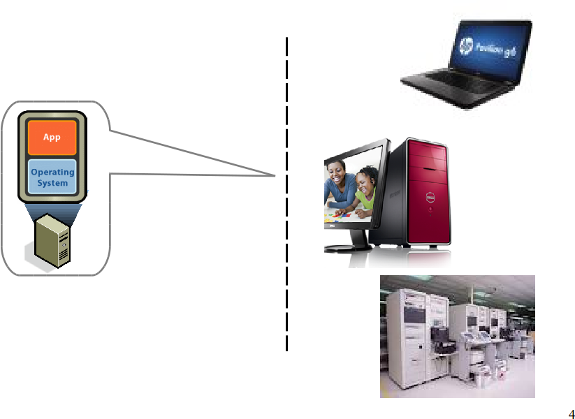
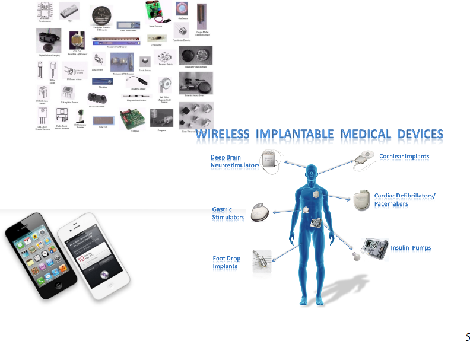
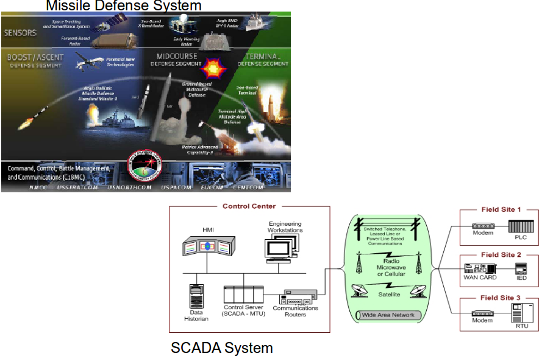
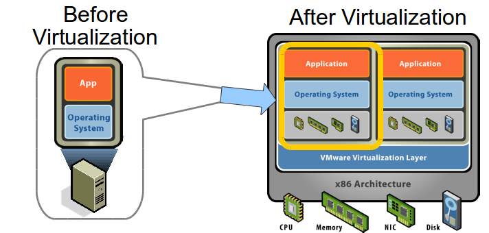
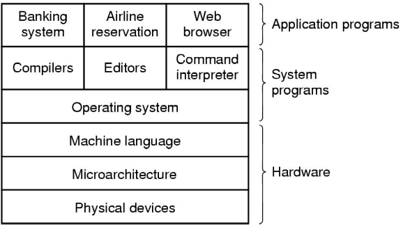

% Lecture 1
% CprE 308
% January 12, 2015 

# Welcome!

## Instructor
 - Jeramie Vens
 - Vens@iastate.edu
 - Research Interests: Sensor Networks & Control Systems

## Course Info
 - Grades on Blackboard
 - Course materials on Blackboard and Github: [https://github.com/CprE308](https://github.com/CprE308).
 - Announcements on Blackboard.
 - IRC Channel on Freenode: #CprE308-ISU
  - Access via IRC client or [http://webchat.freenode.net](http://webchat.freenode.net)

# Why learn about Operating Systems?

## A quick history lesson
 - Computerphile video (6:30 to end): [https://youtube.com](https://www.youtube.com/watch?v=-rPPqm44xLs#t=390)

## A computer, and ....

## More than a computer, and...
 - Sensing & medical devices

## More than a computer, and...
 - Cyber-assisted Critical Infrastructures

## Tech Trend: Virtualization

## Tech Trend: Virtualization
### Basic Idea
 - Decouple \[ OS, *service* \] pair from hardware
 - Multiplex lightly-used services on common host hardware
 - Migrate services from host to host as needed
 - Introduce new \[ OS, *service* \] pairs as needed
 - Examples: VMWare, Xen, Parallel, etc.

## Tech Trend: Mobile/Networked/Distributed Apps

## Tech Trend: Mobile/Networked/Distributed Apps
### Examples
 - Webinar
 - Stock Information
 - On-line TV/Video
 - Group-based Apps: Google Docs, Multiplayer games

# Operating Systems

## Introduction

### A computer system consists of:
 - hardware
 - system programs
 - application programs

## What is an Operating System?

### It is an extended machine
 - Hides messy details which must be performed
 - Presents user with a virtual machine, easy to use abstractions

### It is a resource manager
 - Each program gets time with the resource
 - Each program gets space on the resource

## Floppy Disk I/O
Anybody who directly communicates with the floppy disk controller must deal with:

 - Physical address on disk (disk block)
 - The data recording format
 - Turn on/off the motor
 - Error detection/correction

## Operating Systems History
 - 1945-60: Batch Systems - Cards
 - 1960-70: Spooling Batch Systems - Tapes
    - Spool: Simultaneous Peripheral Operation On Line
 - 1960-: Multiprogramming
 - 1970-: Timesharing
 - 1990-: Real-time, distributed
 - 2000-: Multi-OS?
 - 2005-: WebOS (Web2.0, etc.)

## MS-DOS History
 - On August 12, 1981, IBM introduced its new revolution in a box, the ``Personal Computer'' complete with a brand new operating system from Microsoft and a 16-bit computer operating system called MS-DOS 1.0. 
 - ``I don't think it's that significant.'' - Tandy president John Roach on IBM's entry into the microcomputer field.
 - ``If you are intelligent and know how to apply your intelligence you can accomplish anything'' – Bill Gates

## The Operating System Zoo

 - Personal computer operating systems
    - Single user (usually), performance, GUIs.
    - MS-DOS, Windows, Linux
 - Server operating systems
    - Focus on networking
    - Linux, SunOS, Windows NT
 - Multiprocessor operating systems
 - Real-time operating systems
    - Hard versus soft real-time OS
 - Embedded operating systems
    - Memory, power constraints
 - Smart card operating systems
    - Extreme resource constraints

