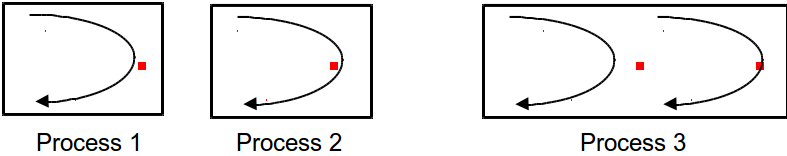

% Lecture 10
% CprE 308
% February 3, 2013

# Intro

## Today's Topics
 - Review
 - Thread Starting
 - Thread Attributes
 - Thread Stopping
 - Thread Examples

# Review

## Threads
 - Need to have multi-programming
    - Many processes executing in parallel
 - Why not use multiple processes?
    - Process creation expensive
    - Each process needs memory, lots of state
    - We don't need all that...
 - Multiple "threads" of control within a single process
 - Threads share process address space

## Process vs. Threads



## The Thread Model

| Per process Items | Per thread items |
|-------------------|------------------|
| Address space | Program counter |
| Global variables | Registers |
| Open files | Stack |
| Child processes | State |
| Pending alarms | |
| Signals and signal handlers | |
| Accounting information | |

## Threads
 - Threads = Parallelism within the same process

 - Will the following benefit from multiple threads?
    - Multiplying huge matrices on a single processor
    - The same problem on multiple processors
    - UNIX Shell

# Implementing Threads

## Threads Standards
<!---
nptl -> Native POSIX Thread Library after Linux 2.6
-->
 - The POSIX standard describes general thread behavior, and the functions which control threads
    - Individual operating systems are allowed some freedom in how threads are implemented, and hence how they behave
 - POSIX 1003.4a -> 1003.1c
    - variants
 - Microsoft
    - Win32

## Create a pthread
<!---
pthread_t could be anything, on my system it's an unsigned long int
-->
 - Use `pthread_create()` to add a new thread of control to the current process.

```c
int pthread_create(
  // The function writes the thread id in tid
  pthread_t *tid,
  // The addr. of a thread_attr object is passed in tattr
  const pthread_attr_t *tattr,
  // The thread runs a function passed in start_routine
  void* (* start_routine) (void*),
  // The start routine's arguments are passed with arg
  void *arg);
```

## Creating a Thread
```c
start_servers() {
  pthread_t thread[nr_of_server_threads];
  int i;
  for (i = 0; i < nr_of_server_threads; i++)
    pthread_create(&thread[i], // thread ID
      0, // default attributes
      server, // start_routine
      argument); // argument
}

void *server(void *arg) {
  while(1) {
    /* get and handle request */
  }
}
```

## Example
<!---
What's wrong with this example?  Multiple arguments, and thread ending
-->
```c
func(int r_in, int r_out, int l_in, int l_out) {
  pthread_t in_thread, out_thread;

  pthread_create(&in_thread,
    0,
    incoming,
    r_in, l_out);
  pthread_create(&out_thread,
    0,
    outgoing,
    l_in, r_out);
}
```

## Complications
```c
func(int r_in, int r_out, int l_in, int l_out) {
  pthread_t in_thread, out_thread;

  pthread_create(&in_thread,
    0,
    incoming,
    r_in, l_out);  // Can't do this ...
  pthread_create(&out_thread,
    0,
    outgoing,
    l_in, r_out); // Can't do this ...
  /* How do we wait till they're done? */
}
```

## Multiple Arguments
```c
typedef struct {
  int first, second;
} two_ints_t;

func(int r_in, int r_out, int l_in, int l_out) {
  pthread_t in_thread, out_thread;
  two_ints_t in={r_in, l_out}, out={l_in, r_out};
  pthread_create(&in_thread,
    0,
    incoming,
    &in);						
  ...
}
```

# Thread Attributes

## Thread attributes
<!---
In linux, there is no PTHREAD_SCOPE_PROCESS, so PTHREAD_SCOPE_SYSTEM is used, such that every thread is scheduled as if it were a process by the scheduler.

Will talk about detaching more later when we talk about ending threads.
-->

Some POSIX thread (pthread) attributes include:

 - A thread may have local or global scope of contention
    - That is, it may compete with all threads in the system for CPU time, or it may compete only with threads in the same task (process)
 - A thread has a priority for scheduling
    - Threads may use several scheduling methods, some of which use priority
 - A thread may be detached
    - Only non-detached threads may be joined
    - `join` is to wait as thread is to process

## The thread attribute object
<!---
pthread_attr_t tattr;
pthread_t tid;
void *start_routine;
void arg
int ret;

// initialized with default attributes
ret = pthread_attr_init(&tattr);

// call an appropriate functions to alter a default value
ret = pthread_attr_*(&tattr,SOME_ATRIBUTE_VALUE_PARAMETER);

// create the thread
ret = pthread_create(&tid, &tattr, start_routine, arg);
-->
 - The attributes of a thread are held in a thread attribute object, which is a struct defined in `pthread.h`
 - You can declare a pthread attribute in your code, but it can only be initialized or modified by the following functions:
    - `int pthread_attr_init(pthread_attr_t *attr);`
    - `pthread_attr_setstackaddr();`
    - `pthread_attr_setstacksize();`
    - `pthread_attr_setdetachstate();`

## The thread attribute object (cont)
 - Creating a thread using a `NULL` attribute argument has the same effect as using a default attribute:
    - Non-detached (joinable)
    - With a default stack and stack size
    - With the parent's priority
 - To create threads with other attributes, the generating attribute object must be modified using the `pthread_attr_set` functions

## Thread Attributes
```c
pthread_t thread;
pthread_attr_t thr_attr;

pthread_attr_init(&thr_attr);

...
/* establish some attributes */
...
pthread_create(&thread, &thr_attr, startroutine, arg);
...
```
Contrast this approach vs providing a long list of parameters

## Stack Size
```c
pthread_t thread;
pthread_attr_t thr_attr;

pthread_attr_init(&thr_attr);
pthread_attr_setstacksize(&thr_attr, 20*1024*1024);
...
pthread_create(&thread, &thr_attr, startroutine, arg);
...
```

## Scheduling policy
<!---
Example, even though this is the default.
-->
```
/* set the scheduling policy to SCHED_OTHER */
pthread_attr_init(&thr_attr);
ret = pthread_attr_setschedpolicy(&thr_attr, SCHED_OTHER);
pthread_create(&thread, &thr_attr, startroutine, arg);
```

# Ending threads

## Something wrong with this
```c
void func(int r_in, int r_out, int l_in, int l_out)
{
  pthread_t in_thread, out_thread;
  two_ints_t in = {r_in, l_out}, out={l_in, r_out};

  pthread_create(&in_thread, 0, incoming, &in);
  pthread_create(&out_thread, 0, outgoing, &out);

  return;
}
```

## When Is It Done?
```c
void func(int r_in, int r_out, int l_in, int l_out)
{
  pthread_t in_thread, out_thread;
  two_ints_t in = {r_in, l_out}, out={l_in, r_out};

  pthread_create(&in_thread, 0, incoming, &in);
  pthread_create(&out_thread, 0, outgoing, &out);

  pthread_join(in_thread, 0);
  pthread_join(out_thread, 0);
}
```

## Waiting for pthreads
 - Use `pthread_join()` to wait for a thread to terminate.
 - Prototype:
```c
int pthread_join(
  thread_t tid,
  void **status);
```
 - The `pthread_join()` function blocks the calling thread until the thread specified by `tid` terminates.  The specified thread must be
    - in the current process, and
    - non-detached

## Waiting for pthreads (cont)
 - The exit status of the thread specified by `tid` is written to `status` when `pthread_join()` returns successfully.
 - Multiple threads cannot wait for the same thread to terminate.  If they try to, one thread returns successfully and the others fall with an error of `ESRCH`

## Termination
`pthread_exit((void *) value);`

`return((void*) value);`

`pthread_join(thread, (void**) &value);`

## Finishing Up
 - An important special case arises when the initial thread - the one calling `main()` - returns from `main()` or calls `exit()`.
 - This action causes the entire process to terminate, along with all its threads.  So take care to ensure that the initial thread does not return from `main()` prematurely.
 - Note that when the main thread merely calls `pthread_exit()` it terminates only itself - the other threads in the process, as well as the process, continue to exist
    - The process terminates when all its threads terminates.

## Detached Threads
```c
start_servers() {
  pthread_t thread;
  int t;
  for ( i=0; i < nr_of_server_threads; i++) {
    pthread_create(&thread, 0, server, 0);
    pthread_detach(thread);
  }
  ...
}

server() {
  ...
}
```

# Examples 

## Example 1
```c
#include <stdio.h>
#include <pthread.h>
#include <string.h>
#define M 3
#define N 4
#define P 5

int A[M][N];
int B[N][P];
int C[M][P];

void *matmult(void *);
```

## Example pt 2
```c
main() {
  int i,error; pthread_t thr[M];
  /* initialize the matrices ... */
  for( i=0; i<M; i++) {  // create the worker threads
    if (error = pthread_create(
        &thr[i], 0, matmult, (void *)i)) {
      fprintf(stderr, "pthread_create: %s", strerror(error));
      exit(1);
    }
  }
  for( i=0; i<M; i++) // wait for workers to finish jobs
    pthread_join(thr[i],0);
  /* print the results ... */
} // end main
```

## Example pt 3
```c
void *matmult(void *arg) {
  int row = (int) arg;
  int col;
  int i;
  int t;

  for(col=0; col < P; col++) {
    t=0;
    for( i=0; i<N; i++)
      t += A[row][i] * B[i][col];
    C[row][col] = t;
  }
  return(0);
}
```

