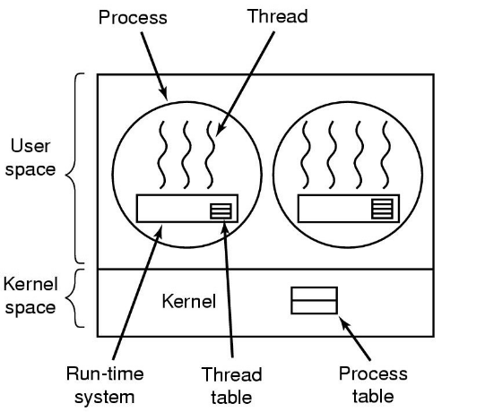
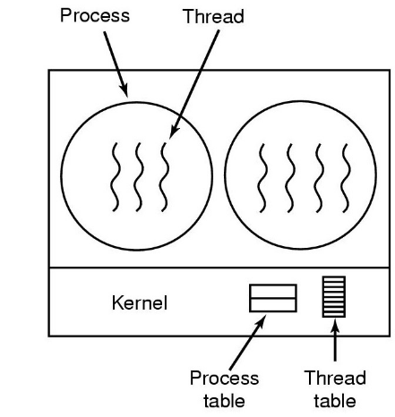
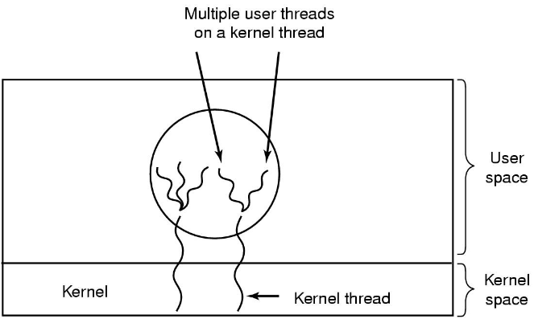
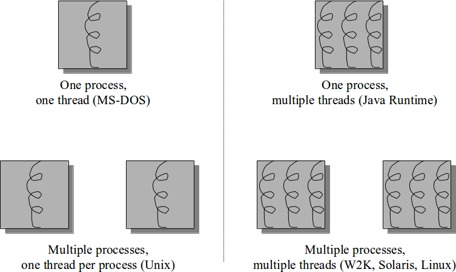
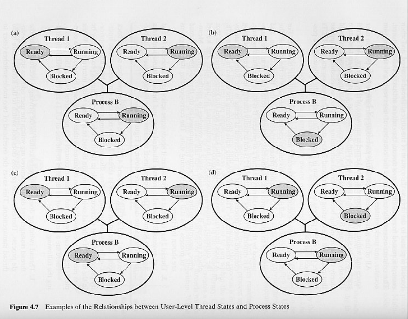

% Lecture 12
% CprE 308
% February 4, 2015

# Intro

## Threads Implementations
 - User Level Threads
 - Kernel Level Threads
 - Hybrid Implementations
 - Performance Comparisons

## What is a Thread?
 - Execution context
    - Registers, Stack
 - Thread execution context smaller than process execution context
 - Any threads library should support the following operations:
    - `thread_create()`
    - `thread_exit()`
    - `thread_wait()`
    - `thread_yield()`

# User Space

## User Space Threads
 - All the thread support provided by a user level library
 - Kernel not even aware that the program has multiple threads
 - User library also handles synchronization (mutexes, condition variables, etc.)

## Implementing Threads in User Space

A user-level threads package

## User Space
<!---
In theory, can use select call to see if system call will block, but requires changes to libraries.

Also, page faults: If instruction is not in memory, we have to get it from disk, thus blocking the entire process, not just the thread.

Once a trap to system call occurs, it's not much work to switch threads.
-->
 - Good:
    - Thread related actions are fast (no system calls)
    - Can be used in OSes which don't implement threads

. . . 

 - Bad:
    - System calls block and other threads will not be able to execute (pretty serious problem - why?)
    - Can't take advantage of a multiprocessor

# Kernel

## Implementing Threads in the Kernel

A threads package managed by the kernel

## Kernel Space
 - Good:
    - Can take advantage of multiple processors
    - System call blocks only the thread which made the call

. . .

 - Bad:
    - Thread operations involve system calls (expensive)

# Hybrid 

## Hybrid Implementations

Multiplexing user-level threads onto kernel-level threads

# Comparisons

## Processes and Threads

 - Resource Ownership - Process or Task
 - Scheduling/execution - Thread or lightweight process

## Single Threaded and Multithreaded Process Models

##

## Key Benefits of Threads

## User and Kernel-Level Threads Performance
 - Performance
    - **Null fork**: the time to create, schedule, execute, and complete a process/thread that involves the null procedure
    - **Signal-Wait**: the time for a process/thread to signal a waiting process/thread and then wait on a condition
    - Procedure call: 7us, Kernel Trap: 17us

 -  Thread Operation Latencies

| Operation | ULT | KLT | Process |
|-----------|-----|-----|---------|
| Null fork | 34  | 948 | 11,300  | 
| Signal wait| 37 | 441 | 1,840

## Threads Performance Observations
<!---
Info on Linux: Does not differentiate between processes/threads, everything is a schedulable task.

Uses clone() system call, with different levels of sharing: CLONE_FILES, CLONE_VM (share memory space).
-->
> - While there is a significant speedup by using KLT multithreading compared to single-threaded processes, there is an additional speedup by using ULTs
> - However, whether or not the additional speedup is realized depends on the nature of the applications involved
> - If most of the thread switches require kerenel mode access, then ULT may not perform much better than KLT

