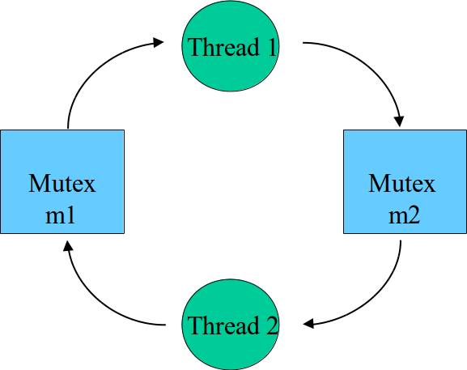

% Lecture 13
% CprE 308
% February 9, 2015

# Intro
 
## Today's Topics
 - Mutual Exclusion (Mutex) 
 - Implementing Mutex

# Threads and Mutual Exclusion

## Threads and Mutual Exclusion
<!---
What is result of this code?
Load, Add, Store
-->
 - Thread 1
```c
x = x + 1;
  /*
    ld  r1,x
    add r1,1
    st  r1,x
  */
```

 - Thread 2
```c
x = x + 1;
  /* same assembly code  */
```

. . .

Final value of x could be 1 or 2 depending on the interleaving

## Protect Shared Variables
<!---
Atomic: Can't (shouldn't) be broken down further, all or nothing.  Appears to rest of system as happening at the same time.
-->
 - If written by many threads, then:
    - Each write should be "atomic"
    - Ensure other threads don't interfere with a *sequence of instructions*
    - A mutex of a "lock" associated with this variable

## Protect Shared Variables
 - Thread 1
```c
lock(mutex);
x = x + 1;
unlock(mutex);
```

 - Thread 2
```c
lock(mutex);
x = x + 1;
unlock(mutex);
```

## Does this need mutual exclusion?
 - Thread 1
```c
my_balance = my_balance + 1;
your_balance = your_balance - 1;
```

 - Thread 2
```c
total = my_balance + your_balance;
```

. . .

Yes. Interleaving may cause thread 2 to see an inconsistent state.

## Do we need mutual exclusion?
 - Thread 1
```c
x = x + 1;
```

 - Thread 2
```c
y = x;
```

. . .

No.  Since the reads and writes are atomic.

## Code with the mutex
Mutex `b_mutex` protects `my_balance` and `your_balance`

 - Thread 1
```c
lock(b_mutex);
my_balance = my_balance + 1;
your_balance = your_balance - 1;
unlock(b_mutex);
```

 - Thread 2
```c
lock(b_mutex);
total = my_balance + your_balance;
unlock(b_mutex);
```

## Mutex and Critical Section
Only one thread can be in the critical section at a time

 - Thread 1
```c
Enter_Mutex();
Critical_Section();
Exit_Mutex();
```

 - Thread 2
```c
Enter_Mutex();
Critical_Section();
Exit_Mutex();
```

# Implementing Mutex

## Our Problem
<!---
Put criteria on board.
-->
 - How to implement `enter_mutex()` and `exit_mutex()`?
    - User space (no OS support)
    - Inside the kernel
 - Solution should satisfy
    - No two threads in the critical region at the same time

## Software (user space) Solution 1
<!---
Won't work - we still have the same issues.  Both processes might read 'busy' as 0 and think they're good at the same time, and then both set it to 1 and enter critical section together.
-->

```c
Enter Mutex:
    while (busy == 1);
    busy = 1;
Critical Section:
    account_balance++;
Exit Mutex:
    busy = 0;
```

`busy` is a (shared) global variable.

. . . 

 - No good, why?

## Software (user space) Solution 2

 - Thread 1
```c
Enter Mutex:
    while (turn == 2);
Critical Section:
Exit Mutex:
    turn = 2;
```

 - Thread 2
```c
Enter Mutex:
    while (turn == 1);
Critical Section:
Exit Mutex:
    turn = 1;
```

`turn` is a (shared) global variable.

## Problems with Solution 2
 - Threads have to strictly alternate
 - One thread wanting to enter the critical section might have to wait for another which does not want to

## Problem Statement Refined
A solution to mutual exclusion should satisfy four conditions:

 1. No two processes simultaneously in critical region
 2. No assumptions made about speeds of CPUs
 3. No process running outside its critical region may block another process
 4. No process must wait forever to enter its critical region

## Concurrent Threads
<!---
Simple example of something that needs to work - v should be 0 at the end.
-->
Initially, `v=0`.

 - Thread 1:
```c
for(i = 0; i< 10; i++)
  v = v+1
```

 - Thread 2:
```c
for(i = 0; i< 10; i++)
  v = v-1
```

## Solutions to Mutual Exclusion
 - Dekker's Algorithm - 1960's
 - Peterson's Algorithm - 1981
 - Hardware support (TSL)

## Peterson's Solution
```c
#define FALSE 0
#define TRUE 1
#define N 2

int turn;
int interested[N];
```

## Peterson's Solution (cont.)
```c
void enter_region(int process); /* 0 or 1 */
{
  int other;
  other = 1 - process;
  interested[process] = TRUE; /* show interest */
  turn = process; /* set flag */
  while (turn == process && interested[other] == TRUE)
}

void leave_region(int process) /* who is leaving */
{
  interested[process] = FALSE; /* indicate departure */
}
```

## Hardware Support: TSL
 - New Instruction:
      `TSL R, Lock`
    - TSL = "Test and Set Lock"
    - R = register
    - Lock = memory location
 - Atomically (atomic = nothing can interfere)
    - Read Lock into R
    - Store a non-zero value into Lock

## Mutual Exclusion using TSL
<!---
Also, lock the memory bus
-->
Hardware Support with `TSL` (Test and Set Lock) Instruction
```c
  TSL Reg, Lock
```
 - Copy value of memory location `Lock` into Register `Reg`
 - Simultaneously write non-zero value into `Lock`

## TSL Example
<!---
Why is this different from other assembly code?  Only one instruction
-->
```c
/* set lock to non-zero, proceed if it was 0 earlier */
enter_region:
  TSL Reg, Lock /* Use TSL Instruction */
  if (Reg != 0) then /* not the first to set to zero */
    Jump enter_region /* try again */
  /* else proceed */

/* Critical section */
/* Increment Account Balance */

exit_region:
  Lock = 0
```

## Problem
 - Busy waiting

. . .

 - Solution: yield to another thread if unable to lock first time

## Eliminate Busy Waiting
```c
/* set lock to non-zero, proceed if it was 0 earlier */
enter_region:
  TSL Reg, Lock /* Use TSL Instruction */
  if (Reg != 0) then { /* not the first to set to zero */
    thread_yield(); /* let somebody else run */
    Jump enter_region /* try again */
  }
    /* else proceed */

/* Critical section */
/* Increment Account Balance */

exit_region:
  Lock = 0
```

## Another Solution: Disable Interrupts
<!---
Timer's can't go off, so only one thread will run
-->
 - Disable interrupts during critical section
    - Prevent context switch
    - Enable interrupts after critical section
 - Good: No busy waiting
 - Problems?

## Problem
<!---
Kernel itself might disable interrupts for a few instructions.
-->
 - Critical Section must be short
    - No multiprogramming possible during critical section
 - Cannot trust users to have a short critical section
 - Used inside the kernel for mutual exclusion

## Multiprocessors
<!---
TSL works because we lock the memory bus.
-->
 - Disabling Interrupts doesn't work
    - Preventing a context switch doesn't ensure that only one process is running
 - Use hardware support: TSL
    - Usually multiprocessors come equipped with such instructions

## Disabling Interrupts: Use in `mutex_lock` (uniprocessor only)
 - mutex is a data structure inside the kernel
 - `mutex_lock()` traps into the kernel
    - Disable interrupts
    - Set Lock
    - If(unsuccessful) then: enable interrupts, `thread_yield()`, try again
    - Enable Interrupts

## Summary of Mutex Implementations
 - Software Solution
    - General solution - works anywhere
 - Disabling interrupts
    - Single processor only
    - Use only in kernel mode
 - Test and set lock
    - General solution - works on multiprocessors
    - Be careful to avoid busy waiting

## Mutex usage in POSIX Threads
```c
pthread_mutex_t m = PTHREAD_MUTEX_INITIALIZER;
// shared by both threads

int x; // also shared

pthread_mutex_lock(&m);
x = x + 1;
pthread_mutex_unlock(&m);
```

## Taking Multiple Locks
 - Thread 1
```c
proc1() {
  pthread_mutex_lock(&m1);
  /* Use object 1 */
  pthread_mutex_lock(&m2);
  /* Use objects 1 and 2 */
  pthread_mutex_unlock(&m2);
  pthread_mutex_unlock(&m1);
}
```

## Taking Multiple Locks (Thread 2)
 - Thread 2
```c
proc2() {
  pthread_mutex_lock(&m2);
  /* Use object 2 */
  pthread_mutex_lock(&m1);
  /* Use objects 1 and 2 */
  pthread_mutex_unlock(&m1);
  pthread_mutex_unlock(&m2);
}
```

## Deadlock


## Dealing with Deadlock
 - Hard
    - is the system deadlocked?
    - will this move lead to deadlock?
 - Easy
    - restrict use of mutexes so that deadlock can't happen

## POSIX mutexes
### `man pthread_mutex_init` on your Linux machine
```c
int pthread_mutex_init(pthread_mutex_t *mutex,
  const pthread_mutexattr_t  *mutexattr);
int pthread_mutex_lock(pthread_mutex_t *mutex);
int pthread_mutex_trylock(pthread_mutex_t *mutex);
int pthread_mutex_unlock(pthread_mutex_t *mutex);
int pthread_mutex_destroy(pthread_mutex_t *mutex);
```
