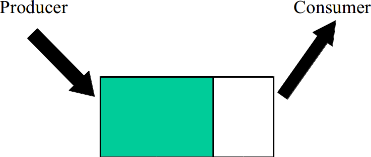

% Lecture 15
% CprE 308
% February 14, 2013

# Intro

## Recap
 - Previously introduced Threads implementation
 - Mentioned Deadlocks...

## Today's Topics
 - Producer Consumer
 - Sleep and Wakeup


# Producer-Consumer

## Producer-Consumer


 - Mutual Exclusion
 - Buffer Full
 - Buffer Empty

## How is this solution?
###
####
##### Producer
```c
while(TRUE) {
  item = produce();
  insert(item,buffer);
  count++;
}
```
####
##### Consumer
```c
while(TRUE) {
  item = remove(buffer);
  count--;
  consume(item);
}
```
## How about this?
<!---
Trying to add mutexes.  Prevents weird buffer accesses, but doesn't prevent filling buffer or trying to read from an empty buffer.
-->
###
####
##### Producer
```c
while(TRUE) {
  item = produce();
  lock(mutex);
  insert(item,buffer);
  count++;
  unlock(mutex);
}
```
####
##### Consumer
```c
while(TRUE) {
  lock(mutex);
  item = remove(buffer);
  count--;
  unlock(mutex);
  consume(item);
}
```
## Producer-Consumer
 - Cannot be solved by mutexes alone
 - Need a way to block till some condition is satisfied
    - Condition variables (preferred with `pthreads`)
    - Semaphores (not part of the `pthreads` package)

# Sleep and Wakeup

## Sleep and Wakeup Variables

##### Shared Variables
 - count (number of items in buffer)
 - buffer
 - N (maximum size of buffer)

## Sleep and Wakeup Example
<!---
Still not great: unrestricted buffer access.
-->
###
####
##### Producer
```c
while(TRUE) {
  item = produce();
  if(count==N)
    sleep();
  insert(item,buffer);
  count++;
  if(count==1)
    wakeup(consumer);
}
```
####
##### Consumer
```c
while(TRUE) {
  if(count==0)
    sleep();
  item = remove(buffer);
  count--;
  if(count==N-1)
    wakeup(producer)
  consume(item);
}
```

## Sleep and Wakeup Example with Locks
<!---
Sleep/Wakeup not necessarily system calls, perhaps a library.

This example is also bad.  If consumer reads 0 right before a context switch, the producer will insert an item and send a wakeup that isn't seen by the consumer.  The consumer then starts again, still sees zero, and sleeps.  The producer continues producing until the buffer fills up and then both sleep.

Possible solution: wakeup waiting bit. In above scenario, producer sets bit to 1.  When consumer then sleeps, it turns bit off and stays awake.  "Piggy Bank" of staying awake.
-->
###
####
##### Producer
```c
while(TRUE) {
  item = produce();
  if(count==N)
    sleep();
  lock(mutex);
  insert(item,buffer);
  count++;
  unlock(mutex);
  if(count==1)
    wakeup(consumer);
}
```
####
##### Consumer
```c
while(TRUE) {
  if(count==0)
    sleep();
  lock(mutex);
  item = remove(buffer);
  count--;
  unlock(mutex);
  if(count==N-1)
    wakeup(producer)
  consume(item);
}
```

# Semaphores

## Semaphore: Interface
<!---
Down (P) -> sleep - like checking the wakeup bit
Up (V) -> Wakeup - like telling the other process to wakeup, adding to the 'piggy bank'
-->
###
####
 - S: Integer value
 - `Down(S)`:
```c
when(S>0)
  S = S - 1;
```
 - `Up(S)`:
```c
S = S + 1;
```

####
#####
 - Atomic actions
 - Down might block
 - Up never blocks

## Semaphore: Implementation
<!---
Disable interrupts in kernel for implementation.  Will be short, so okay.
-->
`Down(S)`

 - `If(S=0)` then
    - Suspend thread, put into a waiting queue
    - Schedule another thread to run
 - Else decrement `S` and return

`Up(S)`

 - Increment `S`
 - If any threads in waiting queue, then
    - release one of them (make it runnable)

Both the above are done **atomically**

## Producer Consumer using Semaphores
##### Shared Variables
 - count (number of items in buffer)
 - buffer
 - N (maximum size of buffer)

##### Semaphores
 - Empty - semaphore initialized to N (number of free slots in buffer)
 - Full - semaphore initialized to zero (number of items in buffer)

## Producer Consumer using Semaphores (Example)
###
####
##### Producer
```c
while(TRUE) {
  item = produce();
  down(Empty);
  lock(mutex);
  insert(item,buffer);
  count++;
  unlock(mutex);
  up(Full);
}
```
####
##### Consumer
```c
while(TRUE) {
  down(Full);
  lock(mutex);
  item = remove(buffer);
  count--;
  unlock(mutex);
  up(Empty);
  consume(item);
}
```

## (Blocking) Mutex - Special case of Semaphore
 - Initialize Semaphore `S=1`
 - Lock Mutex = `Down(S)`
 - Unlock Mutex = `Up(S)`
 - One Difference:
    - With `pthread_mutexes`, only the thread which currently holds the lock can unlock it
    - Semaphores have no such restriction

## Example (Game)
 - Computer Game with multiple players
 - Not more than 2 players in a room
 - Semaphore `S`, initialize `S=2`
 - Player executes
    - `Down(S)` before entering
    - `Up(S)` while leaving

## Producer Consumer using Semaphores with Mutexes
###
####
##### Producer
```c
while(TRUE) {
  item = produce();
  down(Empty);
  down(mutex);
  insert(item,buffer);
  up(mutex);
  up(Full);
}
```
####
##### Consumer
```c
while(TRUE) {
  down(Full);
  down(mutex);
  item = remove(buffer);
  up(mutex);
  up(Empty);
  consume(item);
}
```
## Example (Web Server)
 - Web Server can handle only 10 threads at a time
    - Multiple points where threads are being created
    - How to ensure no more than 10 active threads?

. . .

 - Semaphore with initial value = 10
    - `Down()` before thread creation
    - `Up()` once thread finishes

## POSIX Semaphores
##### `man sem_overview`
 - `int sem_init(sem_t *sem, int pshared, unsigned int value);`
 - `int sem_wait(sem_t *sem); /* decrement */`
 - `int sem_trywait(sem_t *sem);`
 - `int sem_post(sem_t *sem); /* increment */`
 - `int sem_getvalue(sem_t *sem, int *sval);`
 - `int sem_destroy(sem_t *sem);`

## Question
 - What if we changed the order of `lock()` and `down()` in producer/consumer example?

## Switching `lock()` and `down()`
<!---
Why is order important?

If consumer locks mutex first, it's possible that down actually sleeps on an empty buffer.  The producer would never be able to add anything to the buffer and we'd have deadlock.
-->
###
####
##### Producer
```c
while(TRUE) {
  item = produce();
  down(Empty);
  lock(mutex);
  insert(item,buffer);
  count++;
  unlock(mutex);
  up(Full);
}
```
####
##### Consumer
```c
while(TRUE) {
  lock(mutex);
  down(Full);
  item = remove(buffer);
  count--;
  unlock(mutex);
  up(Empty);
  consume(item);
}
```

## Semaphore Example: Implementing `wait()` system call
 - Parent process does a `wait()` system call on child
    - wait till child finishes before exiting
 - What if parent executed `wait()` after child exited?
    - wait should return immediately

## Solution: Semaphore
 - Semaphore `zombie`: initialize to 0
 - Parent: `down(zombie)` inside `wait()`
 - Child: `up(zombie)` upon exiting

# Condition Variables

## Condition Variables
 - Allows a thread to wait till a condition is satisfied
 - Testing if the condition must be done within a mutex
 - With every condition variable, a mutex is associated

## Condition variables Code
<!---
Alternative to cond_signal is pthread_cond_broadcast(&condition_variable);
-->
 - `pthread_cond_t condition_variable`
 - `pthread_mutex_t mutex;`

###
####
##### Waiting Thread
```c
pthread_mutex_t(&mutex);
while(!cond. satisfied) {
  pthread_cond_wait(
    &condition_variable,
    &mutex);
}
pthread_mutex_unlock(
  &mutex);
```
####
##### Signaling Thread
```c
pthread_mutex_lock(&mutex);
/* change variable value */
if(cond. satisfied) {
  pthread_cond_signal(
    &condition_variable);
}
pthread_mutex_unlock(
  &mutex);
```

## Condition variable and mutex
 - A mutex is passed into wait:
`pthread_cond_wait(cond_var,mutex)`
 - Mutex is released before t he thread sleeps
 - Mutex is locked again before `pthread_cond_wait()` returns
 - Safe to use `pthread_cond_wait()` in a while loop and check condition again before proceeding

## Example Usage
 - Write a program using two threads
    - Thread 1 prints "hello"
    - Thread 2 prints "world"
    - Thread 2 should wait till thread 1 finishes before printing
 - Use a condition variable

## Solved using condition variables

###
####
##### Global
```c
int thread1_done = 0;
pthread_cond_t cv;
pthread_mutex_t mutex;
```

. . .

##### Thread 1
```c
printf("hello");
pthread_mutex_lock(&mutex);
thread1_done = 1;
pthread_cond_signal(cv);
pthread_mutex_unlock(
  &mutex);
```

. . . 

####
##### Thread 2
```c
pthread_mutex_lock(&mutex);
while(thread1_done == 0) {
  pthread_cond_wait(
    &cv, &mutex);
}
printf(" world\n");
pthread_mutex_unlock(
  &mutex);
```
