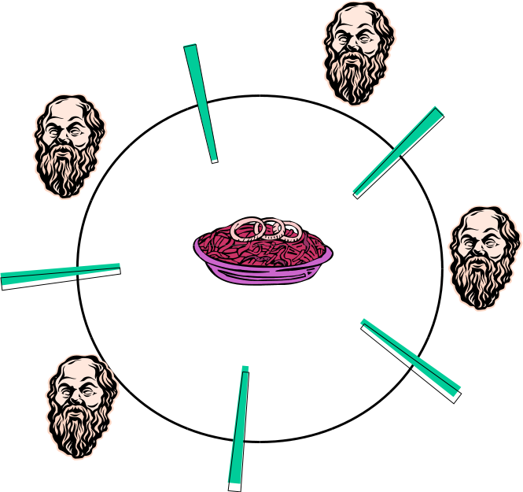

% Lecture 18
% CprE 308
% February 21, 2013

# Intro

## Review
 - Producer Consumer using Semaphores
 - Condition Variables

## Today's Topics
 - Dining Philosophers

# Review

## Review: Producer Consumer using Semaphores
##### Shared Variables
 - count (number of items in buffer)
 - buffer
 - N (maximum size of buffer)

##### Semaphores
 - Empty - semaphore initialized to N (number of free slots in buffer)
 - Full - semaphore initialized to zero (number of items in buffer)

## Review: Producer Consumer using Semaphores (Example)
###
####
##### Producer
```c
while(TRUE) {
  item = produce();
  down(Empty);
  lock(mutex);
  insert(item,buffer);
  count++;
  unlock(mutex);
  up(Full);

```
####
##### Consumer
```c
while(TRUE) {
  down(Full);
  lock(mutex);
  item = remove(buffer);
  count--;
  unlock(mutex);
  up(Empty);
  consume(item);
}
```

## Review: Taking Multiple Locks
###
####
##### Thread A
```c
proc1() {
  pthread_mutex_lock(&m1);
  /* use object 1 */
  pthread_mutex_lock(&m2);
  /* use objects 1 and 2 */
  pthread_mutex_unlock(*m2);
  pthread_mutex_unlock(*m1);
}
```

####
##### Thread B
```c
proc2() {
  pthread_mutex_lock(&m2);
  /* use object 2 */
  pthread_mutex_lock(&m1);
  /* use objects 1 and 2 */
  pthread_mutex_unlock(*m1);
  pthread_mutex_unlock(*m2);
}
```

# Dining Philosophers

## Dining Philosophers
 - Classic Synchronization Problem
 - Philosopher
    - eat, think, sleep
    - eat, think, sleep
    - ......
 - Philosopher = Process
 - Eating needs two resources (chopsticks)

## Dining Philosophers


## First Pass at a Solution
One Mutex for each chopstick

 - Philosopher i:
```c
while(1) {
  Think();
  lock(Left_Chopstick);
  lock(Right_Chopstick);
  Eat();
  unlock(Left_Chopstick);
  unlock(Right_Chopstick);
}
```

. . .

##### Deadlock!

## One Possible Solution
Use a mutex for the whole dinner table

 - Philosopher i:
```c
lock(table);
EAT();
unlock(table);
```

. . .

##### Performance Problem!

## Another Solution
 - Philosopher i:
```c
  Think();
  unsuccessful = 1;
  while(unsuccessful) {
    lock(left_chopstick);
    if(try_lock(right_chopstick)) 
      unsuccessful = 0;
    else unlock(left_chopstick);
  }
  Eat();
  unlock(left_chopstick);
  unlock(right_chopstick);
```

. . . 

##### Starvation if unfavorable scheduling

## In Practice
 - Starvation will probably not occur
 - We can ensure this by adding randomization to the system:
    - Add a random delay before retrying
    - Unlikely that our random delays will be in sync too many times

## Solution with Random Delays
 - Philosopher i:
```c
  Think();
  while(unsuccessful) {
    wait(random());
    lock(left_chopstick);
    if(try_lock(right_chopstick)) 
      unsuccessful = 0;
    else unlock(left_chopstick);
  }
  Eat();
  unlock(left_chopstick);
  unlock(right_chopstick);
}
```

## Another Solution?
<!---
Does this work?  For 3, 4, 5..?
Works, but may have starvation, also unfairness
-->
Suppose two philosophers

##### Philosopher 1:
```c
lock(left_chopstick);
lock(right_chopstick);
```
##### Philosopher 2:
```c
lock(right_chopstick);
lock(left_chopstick);
```

## Yet Another Solution Idea
<!---
Driven by states.
-->
 - Do not try to take forks one after another
    - Don't have each fork protected by a different mutex
 - Try to grab both forks at the same time
 - Text has details (pg. 166)
