% Lecture 19 - Deadlocks
% CprE 308
% February 24, 2013

# Review

## Review
 - Three Examples of Deaclock
    - Multiple Mutex Locks
    - Producer-Consumer Problem
    - Dining PHilosopher Problem

## Review: Producer Consumer using Semaphores
##### Shared Variables
 - count (number of items in buffer)
 - buffer
 - N (maximum size of buffer)

##### Semaphores
 - Empty - semaphore initialized to N (number of free slots in buffer)
 - Full - semaphore initialized to zero (number of items in buffer)

## Review: Producer Consumer using Semaphores (Example)
###
####
##### Producer
```c
while(TRUE) {
  item = produce();
  down(Empty);
  lock(mutex);
  insert(item,buffer);
  count++;
  unlock(mutex);
  up(Full);

```
####
##### Consumer
```c
while(TRUE) {
  down(Full);
  lock(mutex);
  item = remove(buffer);
  count--;
  unlock(mutex);
  up(Empty);
  consume(item);
}
```

## Review: Taking Multiple Locks
###
####
##### Thread A
```c
proc1() {
  pthread_mutex_lock(&m1);
  /* use object 1 */
  pthread_mutex_lock(&m2);
  /* use objects 1 and 2 */
  pthread_mutex_unlock(&m2);
  pthread_mutex_unlock(&m1);
}
```

####
##### Thread B
```c
proc2() {
  pthread_mutex_lock(&m2);
  /* use object 2 */
  pthread_mutex_lock(&m1);
  /* use objects 1 and 2 */
  pthread_mutex_unlock(&m1);
  pthread_mutex_unlock(&m2);
}
```

## Dining Philosophers
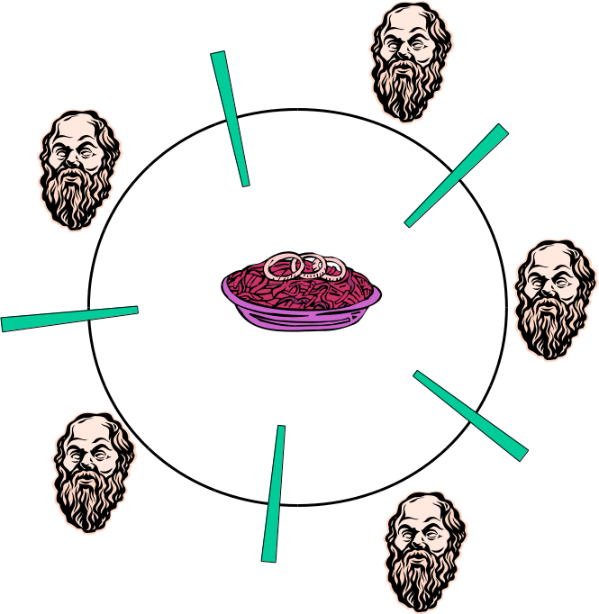


# Intro

## Deadlocks
Chapter 6

 1. Resources
 2. Introduction to Deadlocks
 3. The Ostrich Algorithm
 4. Deadlock detection and recovery
 5. Deadlock avoidance
 6. Deadlock prevention
 7. Other issues

## Resources
 - Examples of computer resources
    - printers
    - tape drives
    - tables
 - Processes need access to resources in reasonable order
 - Suppose a process holds resource A and requests resource B
    - At same time another process holds B and requests A
    - Both are blocked and remain so

## Resources (Cont)
 - Deadlocks occur when...
    - Process are granted exclusive access to devices
    - We refer to these devices generally as *resources*
 - Preemptable resources
    - Can be taken away from a process with no ill effects
 - Nonpreemptable resources
    - will cause the process to fail if taken away

## Resource (Cont)
 - Sequences of events required to use a resource
    1. Request the resource
    2. Use the resource
    3. Release the resource
 - Must wait if request is denied
    - Requesting process may be blocked
    - May fail with error code

## Introduction to Deadlocks

 - Formal definition:

>  A set of processes is deadlocked if each process in the set is waiting for an event that only another process in the set can cause.

 - Usually the event is release of a currently held resource
 - None of the processes can...
    - run
    - release resources
    - be awakened

## Four Conditions for Deadlock
<!---
What happens when each of the conditions is false?  Why would we not have deadlock.  Necessary and sufficient?
-->
 1. Mutual Exclusion condition
    - each resource assigned to 1 process or is available
 2. Hold and wait condition
    - process holding resources can request additional
 3. No preemption condition
    - previously granted resources cannot be forcibly taken away
 4. Circular wait condition
    - must be a circular chain of 2 or more processes
    - each is waiting for resource held by next members of the chain

# Modeling

## Deadlock Modeling
<!---
Processes are circles
Resources are squares
-->
 - Modeled with directed graphs

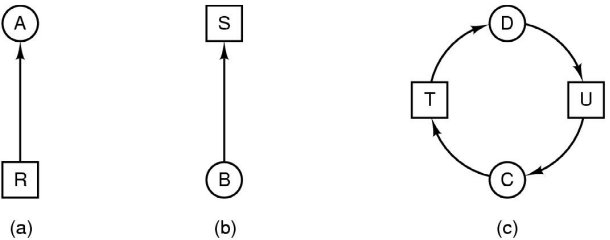

 - resource R assigned to process A
 - process B is requesting/waiting for resource S
 - process C and D are in deadlock over resources T and U

## Deadlock Modeling
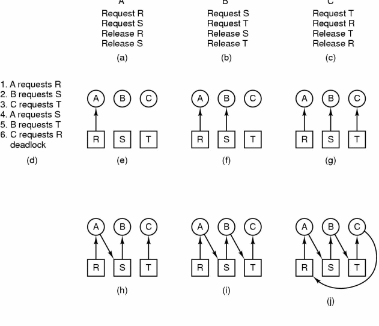

## Deadlock Strategies
##### Strategies for dealing with deadlocks
 1. Just ignore the problem altogether
 2. Detection and recovery
 3. Dynamic avoidance
    - careful resource allocation
 4. Prevention
    - Negating one of the four necessary conditions

# Ostrich Algorithm

## Ostrich Algorithm
<!---
As an engineer, might be valuable if costs to fix outweigh benefits.
-->
Stick your head in the sand

 - Pretend there is no problem at all

# Detection

## Deadlock Detection and Recovery
Do not attempt to *prevent* deadlocks

 - Instead, detect after the fact and then recover

## Deadlock Detection
 - Suppose you were given
    - The resource currently held by each
    - The additional resources each process wants
 - Question:
    - Is the system deadlocked?

## Detection with One Resource of Each Type
<!---
Basic Algorithm: Do depth-first search from each node, looking for cycles

Mention multiple resources before moving to next slide.
-->
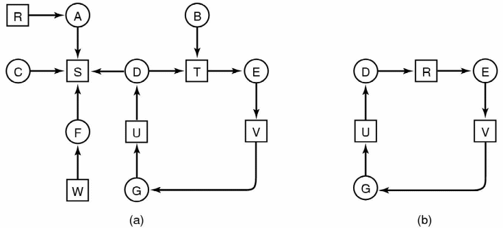

 - Note the resource ownership and requests
 - A cycle can be found within the graph, denoting deadlock

## Deadlock Detection Rule (Algorithm)
 - Is there some order of execution of the processes which allows all of them to complete?
    - If yes, then not deadlocked
    - If no such order exists, then deadlocked
 - After each process finishes, it releases resources back to the system

## Example 1
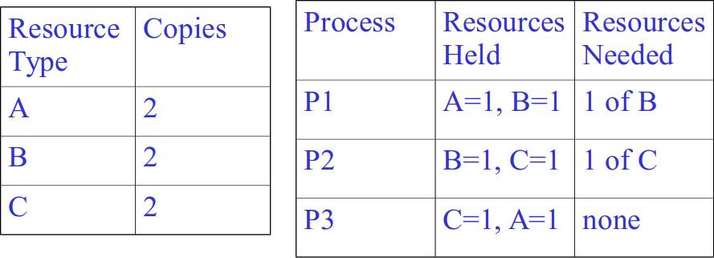

. . .

Not deadlocked, since P3 can run, releasing resources for P2, which releases resource to P1 upon finishing

## Example 2
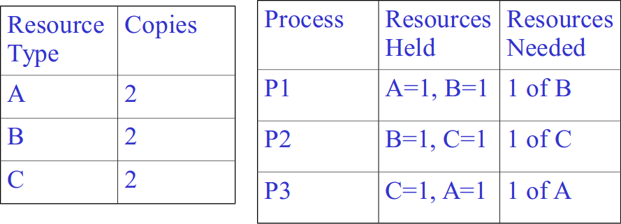

. . .

Deadlocked, since nobody can make progress

## Example 3
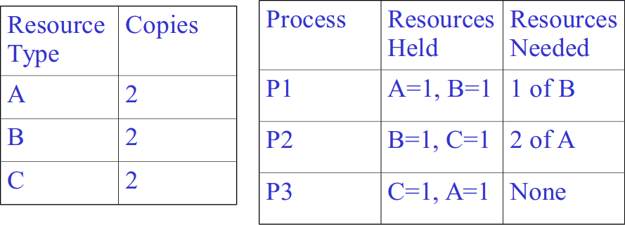

. . .

Deadlocked:

 - Let P3 complete
 - P3 releases resources.  But then, nobody else can proceed

## Detection with Multiple Resources of Each Type
<!---
P - processes
E - vector of number of (existing) resources per class
A - available resource vector
C - matrix of current allocation. i-th row for Pi
R - request matrix. i-th row for Pi
Cij # of instances of resource j held by process i

\sum_{i=1}^n C_{ij} + A_j = E_j
-->
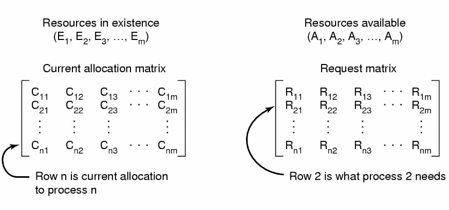

Data structures needed by deadlock detection algorithm

## Detection with Multiple Resources of Each Type (cont.)
<!---
Algorithm:
1. Look for unmakred process, P_i, for which i-th row of R is \leq A
2. If process found, add i-th row of C to A, mark process, go back to 1.
3. If no such process exists, algorithm terminates

Use this algorithm for previous examples to solve formally.
-->
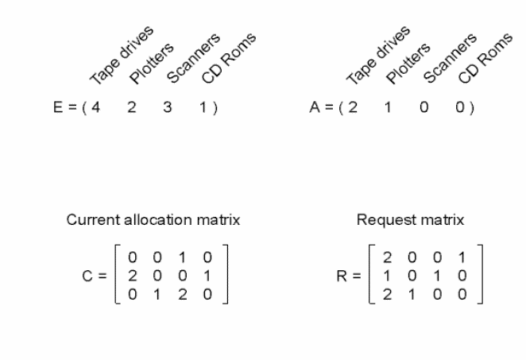

An example for the deadlock detection algorithm

## Recovery from Deadlock
 - Recovery through Preemption
    - Take resource away from owner and give it to another
 - Recovery through Rollback
    - Roll back execution to checkpoint
 - Recovery through Killing-Process
    - Kill process to break cycle

# Avoidance

## Deadlock Avoidance
 - Be very conservative when granting resources
 - Don't grant a resource if it could lead to a *potential deadlock*
 - Not very practical, since this is too much overhead for granting resources

## Resource Trajectories
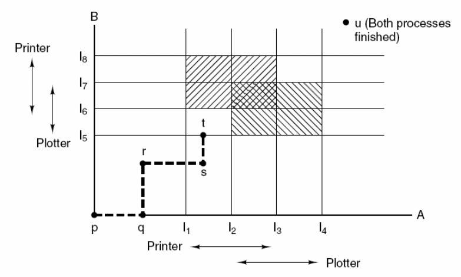

## Safe and Unsafe States
<!---
Safe - guarantee that we can finish
Unsafe - no guarantee that we can finish, but not necessarily deadlocked
-->
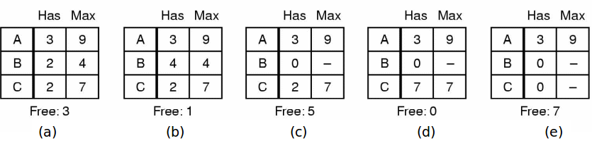

Demonstration that the state in (a) is safe

## Safe and Unsafe States (cont.)
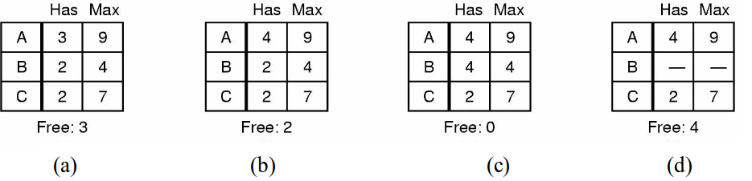

Demonstration that the state in (b) is not safe

## The Banker's Algorithm for a Single Resource
<!---
Algorithm:
before giving resource, make sure that the state is safe, by checking to make sure there is a path to completion.
-->
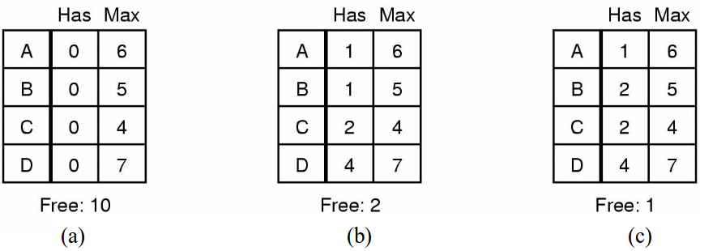

. . .

 - Three resource allocation states
    - Safe
    - Safe
    - Unsafe

## Banker's Algorithm for Multiple Resources
<!---
Algorithm:
1. Look for row R whose unmet resource needs smaller than A (available).  If no row exists, system will eventually deadlock.
2.  Assume process of chosen row requests all resources and finishes.  Mark as terminated and add resources to A.
3. Repeat 1 and 2 until all marked terminated  or no process is left whose needs can be met.
-->
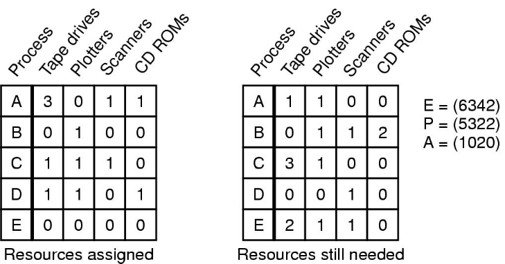

Example of a banker's algorithm with multiple resources

# Prevention

## Deadlock Prevention
 - Attacking the mutual exclusion condition
 - Attacking the hold and wait condition
 - Attacking the no preemption condition
 - Attacking the circular wait condition

## Attacking the Mutual Exclusion Condition
Somehow allow multiple processes to use resources

 - Example: Printer Spooling

## Attacking the Hold and Wait Condition
 - Require processes to request resources before starting
    - a process never has to wait for what it needs
 - Problems
    - may  not have required resources at start of run
    - also ties up resources other processes could be using
 - Variation:
    - process must give up all resources
    - then request all immediately needed

## Attacking the No Preemption Condition
 - This is not a viable option
 - Consider a process given the printer
    - halfway through its job
    - now forcibly take away printer
    - !????
    - Profit(?)

## Attacking the Circular Wait Condition
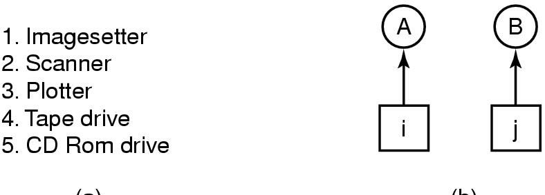

 - Normally ordered resources
 - A resource graph

## Deadlock Prevention summaries
| Condition        | Approach                        |
|------------------|---------------------------------|
| Mutual exclusion | Spool everything                |
| Hold and wait    | Request all resources initially |
| No preemption    | Take resources away             |
| Circular wait    | Order resources numerically     |

## Nonresource Deadlocks
 - Possible for two processes to deadlock
    - each is waiting for the other to do some task
 - Can happen with semaphores
    - each process required to do a `down()` on two semaphores (*mutex* and another)
    - if done in wrong order, deadlock results

## Other Issues
 - Two-phase locking
 - Communication deadlocks
 - Livelock
 - Starvation

## Communication Deadlocks
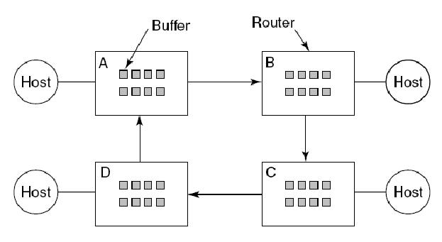

## Livelock
###
####
#####
```c
void process_1(void) {
  enter_region(&resource_1);
  enter_region(&resource_2);
  use_both_resources();
  leave_region(&resource_2);
  leave_region(&resource_1);
}
```

####
#####
```c
void process_2(void) {
  enter_region(&resource_2);
  enter_region(&resource_1);
  use_both_resources();
  leave_region(&resource_1);
  leave_region(&resource_2);
}
```
