% Lecture 2
% CprE 308
% January 14, 2015

# Computer Hardware Review

## Components of a single personal computer

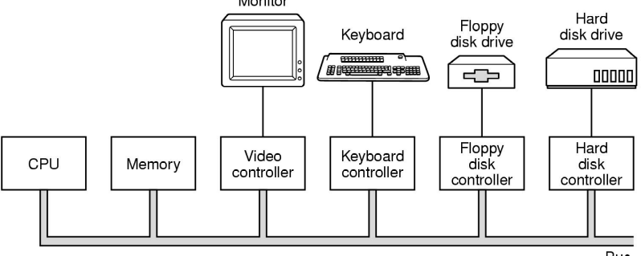

## Sample CPU Architecture

 a. A three-stage pipeline
 b. A superscalar CPU

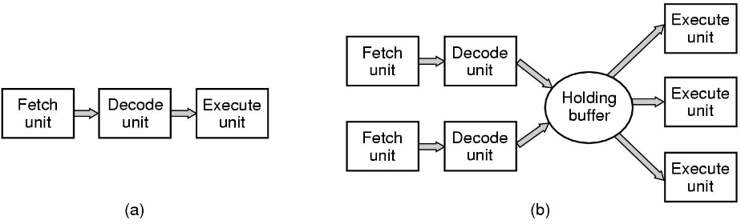

## Typical memory hierarchy

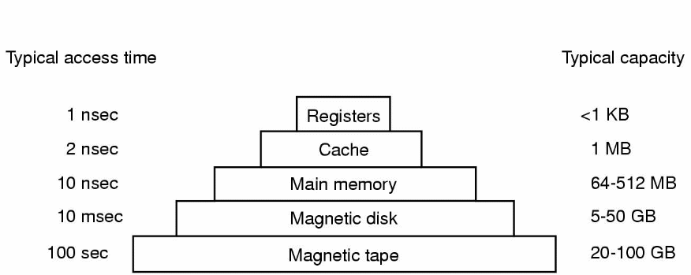

 - numbers shown are rough approximations

## Structure of a disk drive

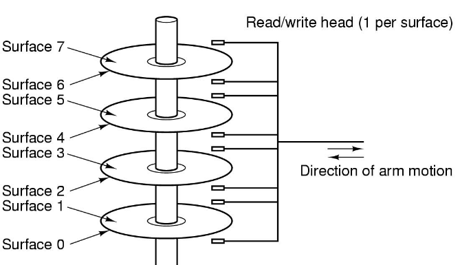

## Interrupts

 a. Steps in starting an I/O device and getting an interrupt
 b. How the CPU is interrupted

## Structure of a large Pentium system

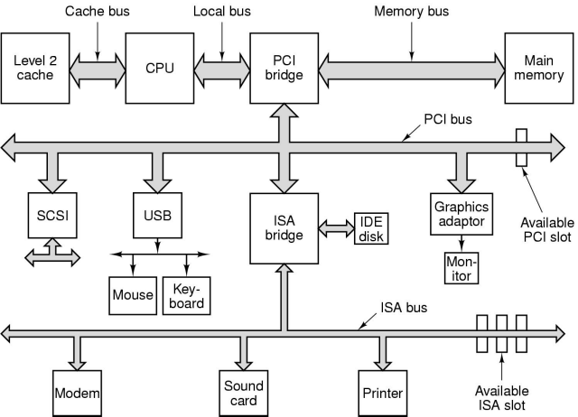

# Programs & Processes

## Program vs. Process

### A process is a program in execution
 - Program is a piece of code
 - Process has ``state'' (what could this state be?)

### There could be multiple processes all simultaneously executing the same program
 - Coordinate accesses and sharing of resoures
 - Sharing in time - CPU cycles
 - Sharing in space - Memory

## Processes

 - Process = program in execution
    - Address space: Program (text), data, stack
    - Registers: Program counter, stack pointer, etc.
 - Process can be created, suspended, restarted, killed (!)
 - Process scheduler decides which process to run next among all the current processes 

## Process Creation

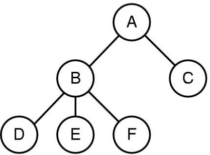

 - In UNIX, there is a way for one process to ``spawn'' more processes
 - A process tree
    - Process A created two child processes, B and C
    - Process B created three child processes, D, E, and F

## Memory Sharing

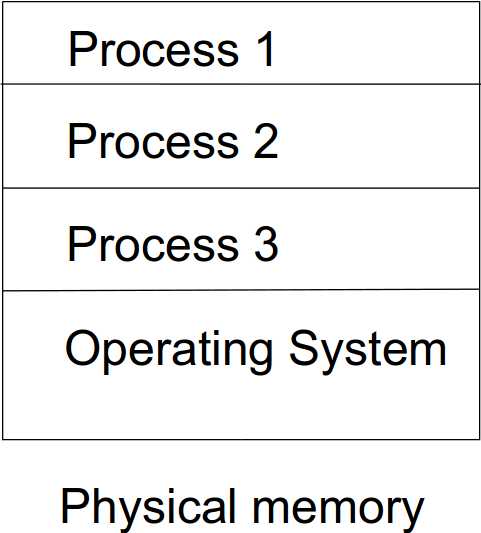

# Files

## Mounting Files (UNIX)
<!---
Files organized in directories with a hierarchy, like a tree.  Top is called Root directory.  Process runs in working directory.

More about files in Chapter 4.
-->
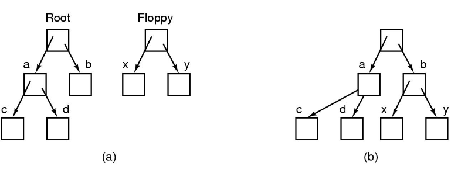

 - Before mounting,
    - files on floppy are inaccessible
 - After mounting floppy on b,
    - files on floppy are part of file hierarchy

## Inter process communication (UNIX)

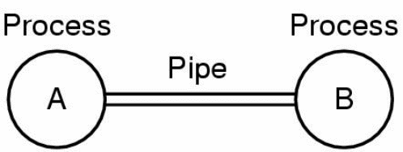

 - A  *pipe* is like a pseudo file
 - Processes set up a pipe in advance
 - Processes read from or write to a pipe

# System Calls

## Structure of UNIX
<!---
Shell is the 'command interpreter' - primary interface between user and OS.

Example: cat *.txt | sort
-->

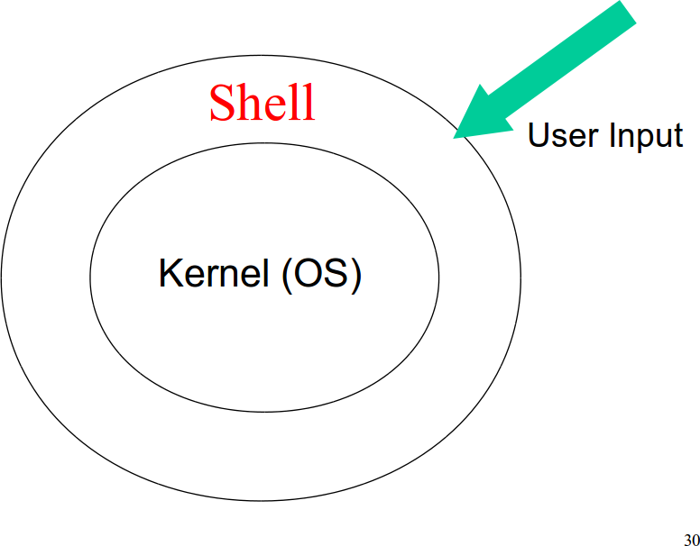

## System Calls

 - Interface between the user and the operating system (kernel)
 - Handle processes, files, directories, time, input/output
 - Switch processor from user to kernel mode
    - In *User mode*, some instructions are forbidden
    - In *Kernel mode*, all instructions are allowed

## Example
 - Read from file

    n = read(fd, buffer, nbytes);

 - Change directory

    s = chdir(dirname);

 - Get time

    s = time(&seconds);

## System Calls for File Management
<!---
First have to open file with fd. OS keeps track of file mode, size, times, etc.
-->
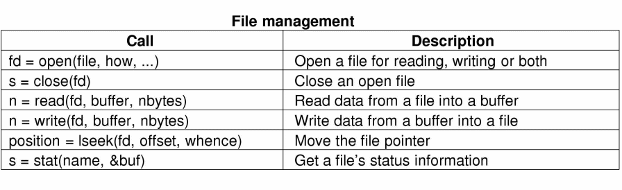

## System Calls for Directory Management
<!---
First two create and remove directories.

For linking: discuss i-nodes.
Each file has unique number, called i-number that identifies it -> index into table of i-nodes.  Conceptually, a directory is a set of (i-number, ASCII name) pairs.
-->
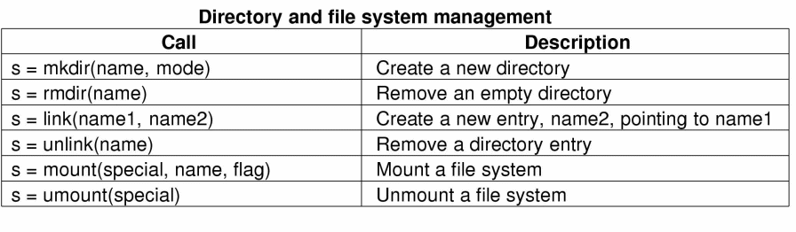

## System Calls for Miscellaneous Tasks

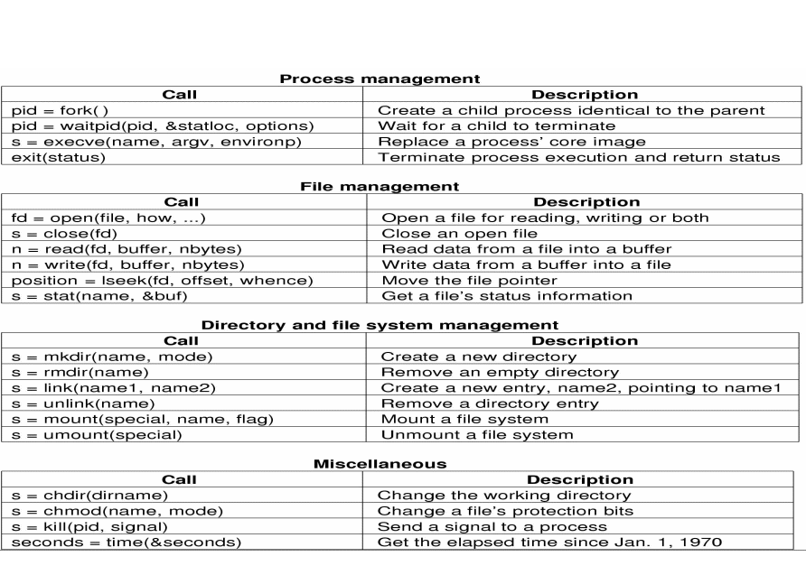

## Quick Questions

### Do these belong in the OS?
> - Text editor
> - Compiler
> - Web browser
> - Shell
> - Email client
> - Program which copies files
> - Device driver (program which controls a hardware device)
