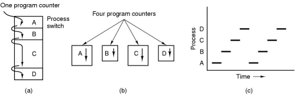
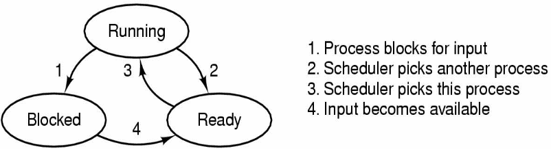
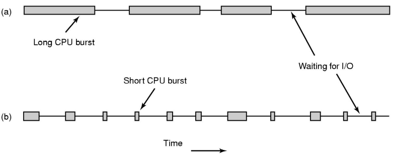
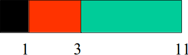
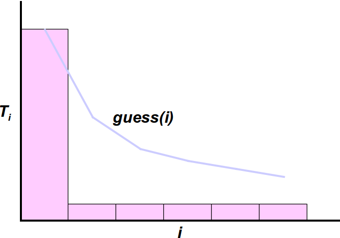
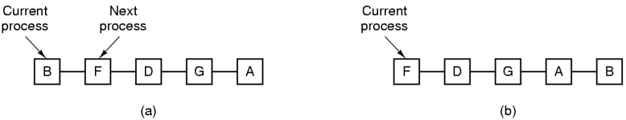
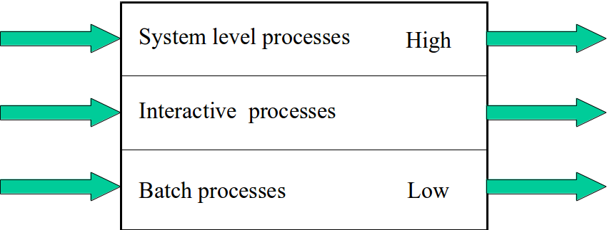
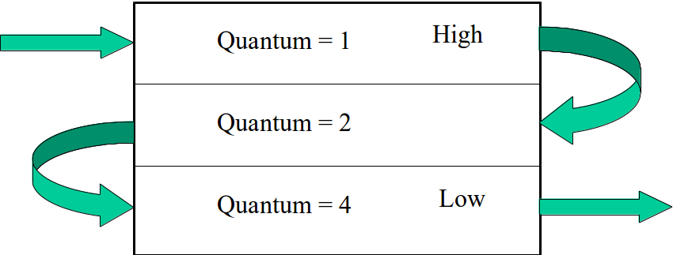

% Lecture 25 - Process Scheduling
% CprE 308
% February 10, 2014

# Process Scheduling Basics

## Process/Thread States

## Scheduling

Different Types of jobs have different demands

 - A CPU-bound process
 - an I/O bound process

## Preemption
 - Non-preemptive Scheduling: Processes run until they have finished or block for I/O
 - Preemptive Scheduling: Can forcibly suspend a process and switch to another
 - Clock Interrupt helps in implementing preemption
    - Overhead of preemption

## Process Scheduling

**Basic Question**: Which process goes next?

 - Personal Computer
    - Few processes, interactive, low response time
 - Batch Systems (Compute Servers)
    - Many processes, not interactive, throughput is important
 - Real Time Systems
    - Guaranteed response times, meet deadlines

## Scheduling Algorithm Goals
 - Minimize Response time
 - Maximize throughput i.e. number of jobs/hour
 - Fairness among jobs, users(?)
 - Maximize CPU utilization
 - Minimize Context Switch Overhead

# Batch Scheduling

## First Come First Serve (FCFS)
 - Maintain queue of processes
 - Schedule first in queue
 - Scheduled job executes until it finishes or blocks for I/O
 - Simple, easy to implement
 - Not good for mix of short and long jobs
    - Example: a short job arriving soon after a long one

## Shortest Job First (batch systems, non-preemptive)
 - Suppose 3 jobs arrive: length 8,2,1

 - Shortest Job First:

Sum of response times=15

 - Scheduler X:

Sum of response times=29

## Shortest Remaining Time Next (preemptive)
 - Next schedule the job with the shortest time to completion
 - Fairness problems: A long job might be continually pre-empted by many short jobs

# Interactive Scheduling

## Realistically . . .
 - Jobs don't run to completion
    - run till they block for user input
 - Don't know the length of "jobs"
 - How long is that?
    - Predict using past behavior
    - $guess = \sum (T_i) / n$

## Mean Guessing

## Exponential Averaging
 - $guess_i = a(new\_data) + (1-a)(guess_{i-1})$
    - $a$: weight given to new data
    - $(1-a)$: weight given to previous guess

## Round Robin (Interactive Systems)

 - Give CPU time to each process by turn
 - Quantum = CPU time alloted every turn
 - How is this better than shortest remaining time next for long jobs?
 - How to choose the value of the quantum?
    - Too small might mean high context switch overhead
    - Too large might mean bad response times

## Priority Scheduling
Different Priorities

 - Background process sending mail vs:
 - Shell process accepting input

Requirement:

 - Schedule jobs with highest priority first
 - Issues: high priority jobs should not overwhelm the others
    - Might decrease priority with time

## Multiple Queues - static version

 - Lower priority queues don't run if higher priority queues non-empty
 - Could time slice between queues

## Multiple Queues - dynamic version

 - Process enters high priority level
 - If takes more than 1 quantum, move to second highest priority, ...

## Multiple Queues - dynamic version

 - Higher priority = faster service, but short service times
 - Reduce number of context switches for long processes
 - What about a process which became interactive after a long bout of computation
    - Increase priority?

## Lottery Scheduling: Another implementation priorities

 - Example: 3 processes, priorities 2,3,5
 - Distribute 20,30,50 tickets respectively
 - System holds "lottery" 50 times per second
    - Winner gets 20 ms of CPU time
 - Gives probabilistic guarantees

# Real-time Scheduling

## Real-time scheduling

 - Provide time guarantees
 - Upper bound on response times
    - Programmer's job
    - Every level of the system
 - Soft versus hard real-time
    - Streaming mp3 player versus air-traffic controller

## CPU Scheduling: Summary
 - FCFS
 - Shortest job first, shortest remaining job next
 - Round robin - context switch overhead
 - Priority scheduling
    - Multi-level queues
    - Lottery Scheduling
 - Real-time schedule - schedulability
