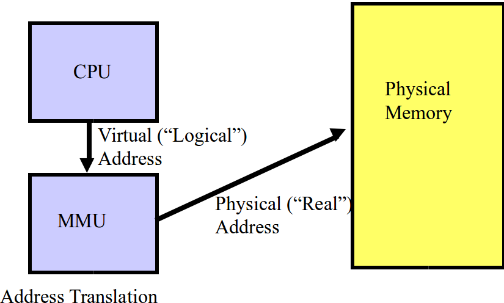
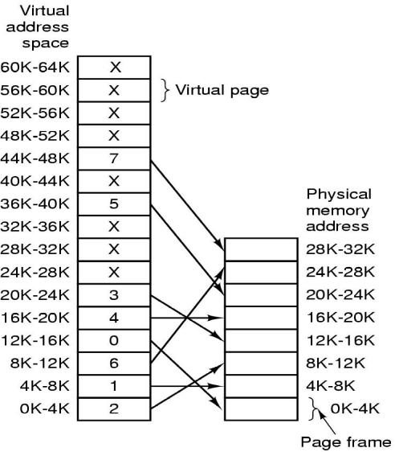

% Lecture 28 - Memory Management
% CprE 308
% March 24, 2014

# Memory Management

## Overview
Ideal World (for the programmer):

 - I'm the only process in the world
 - I have a huge amount of memory at my disposal

Real World

 - Many processes in the system
 - Not enough memory for them all

## Goal of Memory Management
 - Present the ideal world view to the programmer, yet implement it on a real system

## Simple Memory Management
 - One program at a time (not ideal for performance)
 - What does running a program involve?
    - Load program into memory
    - Jump to the first instruction
 - Issues:
    - Need to protect the OS from the user program
    - Relocation: User memory references should lead to real memory locations

## Memory Fence

## The Relocation Problem
 - Your Program is complied and linked
    - Generates (absolute) addresses
 - When being loaded into memory, can't predict which address it will be loaded in
 - How to ensure correct memory addresses are used, and to manage protection?
 - One solution: at loading time, update all the addresses to reflect correct physical addresses
    - Still does not ensure protection

# Address Space

## The Address Space Concept
 - Protect processes from one another
 - Protect the OS from user processes
 - Provide efficient management of available storage

## Base and Bounds Registers
<!---
Base and Limit registers in book
Base - program start
limit - program length.
during reference (both fetch and read/write), add base value to address generated
-->

## Swapping

## Address Space
<!---
Discuss memory management with bitmaps and linked lists.
-->
 - Each process has it's own "address space" - set of addresses the program generates
 - Memory Manager maps the address space onto Physical Memory + Secondary Storage
 - Address spaces of different processes don't overlap

# Virtual Memory

## Advantages of Virtual Memory
 - Program size can be larger than physical memory
    - Some pages in memory, some on the disk
 - Processes can run fast as long as all their active pages are in memory (compare with swapping)

## Virtual Memory

## Memory Management Unit (MMU)

## Virtual memory
 1. Process generates a "virtual address"
 2. Virtual address is translated into a physical address (translation is more sophisticated than in base + bound registers)
     - Base + Bound: add and compare for every memory reference
     (Translation done differently for different processes)
 3. Physical address goes onto the bus

## Structuring Virtual Memory
 - Paging
    - divide the address space into fixed-size pages
    - Internal fragmentation
 - Segmentation
    - divide the address space into variable-size segments (typically each corresponding to some logical unit of the program, such as a module or subroutine)
    - External fragmentation
 - Paged segmentation

## MMU - a closer look
Lookup the virtual address

 - If present in physical memory, they fetch it
 - If not, then call upon the operating system ("page fault")
    - OS loads the required page into memory from secondary storage
    - Instruction is re-started

# Address Translation

## Address Translation Problem
 - Given the virtual address
 - To find:
    - If in memory, the physical address
    - Else, answer saying "not in memory"
 - Constraint: Space overhead of translation should be small

## Page Tables
###
####
 - 64K Virtual Address Space
    - Divided into 16 pages, of 4K each
 - 32K Physical Memory
    - 8 pages of 4K each

####

## Page Table

## Page Fault
What if required page not in memory?

 1. Page fault gives control to the OS
 2. OS fetches it from the disk
    - Needs to evict an existing page from memory (page replacement policy)
 3. Instruction is restarted

## Typical Page Table Entry

## Performance
 - The address translation is done on every memory reference
 - Maybe twice per instruction
    - Instruction fetch
    - Fetch Memory operand
 - The translation better be fast!

## Different Schemes for Address Translation
 - Page Table - most popular
 - Translation Lookaside Buffer (TLB)
    - Performance reasons (cache)
 - Inverted Page Table
    - Large address spaces

## Memory Management with Linked Lists
 - Maintaining a linked list of allocated and free memory segments
 - First fit
 - Best fit
 - Worst fit

## Question
Where is the page table stored?

 - Registers?
 - Memory?
