% Lecture 30 - Paging and Page Faults
% CprE 308
% March 27, 2015

# Paging

## Review: Scenario
Ideal World (for the programmer)

 - I'm the only process in the world
 - I have more memory than I need at my disposal

Real World

 - Many processes in the system
 - Not enough memory for them all
 - Not all processes play nicely

## Review: Goal of Memory Management
 - Present the ideal world view to the programmer, yet implement it on a real system
 - Add memory protections without getting in the way of the programmer

## Review: Virtual Memory
<!--
Source: http://www.tldp.org/LDP/tlk/mm/memory.html

"To make this translation easier, virtual and physical memory are divided into handy sized chunks called pages. These pages are all the same size, they need not be but if they were not, the system would be very hard to administer. Linux on Alpha AXP systems uses 8 Kbyte pages and on Intel x86 systems it uses 4 Kbyte pages. Each of these pages is given a unique number; the page frame number (PFN)."
-->

## Structuring Virtual Memory
<!--
In paging the address space is divided into a sequence of fixed size units called page frames. A logical (virtual) address takes the form of a tuple <page, offset into page frame>.

In segmentation, the address space is divided into a preset number of segments like data segment (read/write), code segment (read-only), stack (read/write) etc. The logical components of programs are divided into these segments accordingly and the OS kernel enforces the security restrictions of each segment. A logical (virtual) address is represented as tuple <segment, offset into segment>.

Paging helps reduce fragmentation and ensures better memory management, while segmentation offers better security protections (ex: data fields can't be executed).  Most modern OS's employ a mixture of the two schemes.  Instead of an actual memory location the segment information includes the address of a page table for the segment. When a program references a memory location the offset is translated to a memory address using the page table. A segment can be extended simply by allocating another memory page and adding it to the segment's page table.
-->
 - Paging
    - Divides the address space into fixed-sized pages
    - Reduces fragmentation, increases efficiency
 - Segmentation
    - Divides the address space into variable-sized segments
    - Enables memory protections (Example: data, code, uninitialized, shared memory, etc.)
 - Modern OS's use a mixture of both schemes (paged segmentation)
 
## Typical Page Table Entry
<!--
Zooming in on a single entry:
 - Page frame number: physical location of page frame (then add offset)
 - Present/absent: 1 if entry is valid, 0 if not in memory
 - Protection: what sorts of accesses permitted. 0 for read/write, 1 for read only.  Or 3 bits: read,write,execute
 - Modified: Has it been modified?  *Dirty* bit
 - Referenced: set when referenced. Helps to choose eviction
 - Cache disabling: for pages that map device registers rather than memory.
-->
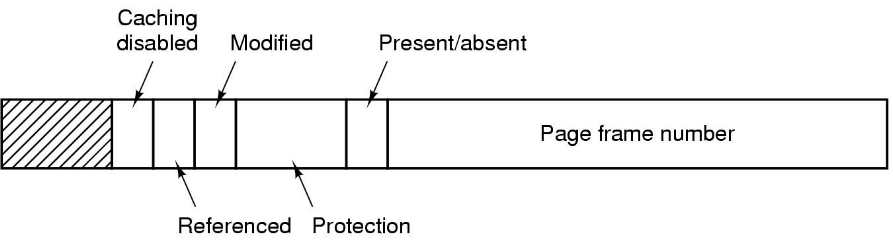

## Paging Example
- Consider a virtual memory system with two processes
    - Let the physical memory consist of 24 words and the page frame size of four words 
    - Process 1 consists of 16 words (a through p)
    - Process 2 consists of 12 words (A through L)
    
## Paging Example (Process 1 Virtual Memory)
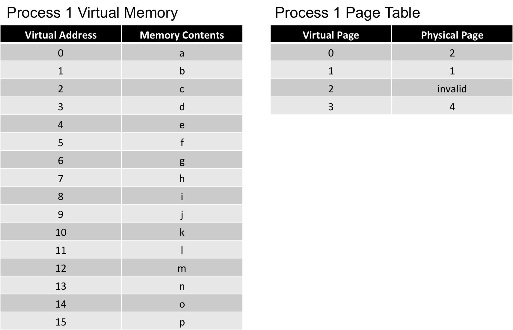

## Paging Example (Process 1 Virtual Memory)
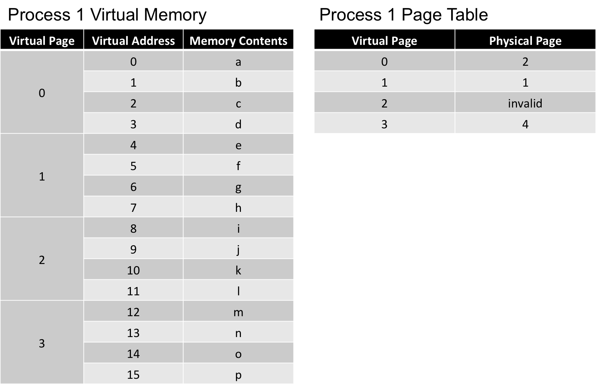

## Paging Example (Process 2 Virtual Memory)

## Paging Example (Process 2 Virtual Memory)
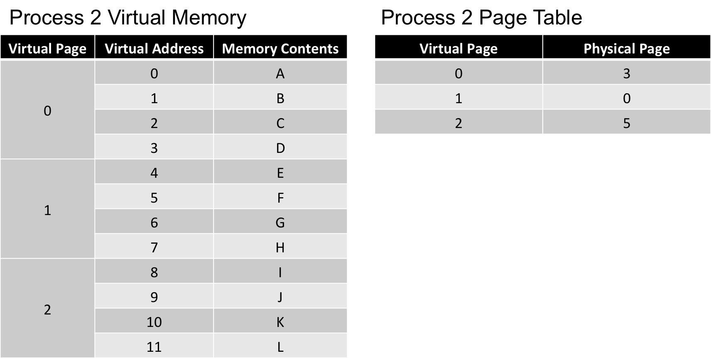

## Paging Example (Physical Memory)
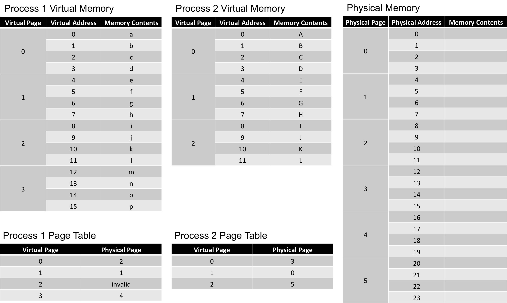

## Paging Example (Physical Memory)

## Paging Example (Physical Memory)

## Paging Example (Physical Memory)

## Paging Example (Physical Memory)
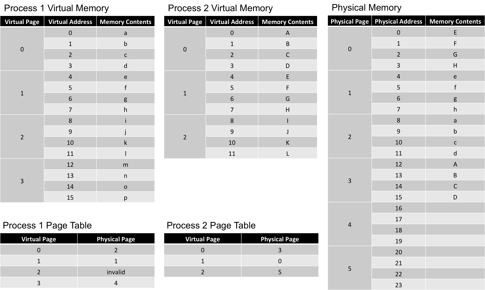

## Paging Example (Physical Memory)

## Paging Example (Physical Memory)

## Paging Example (Physical Memory)
- Suppose process 1 is running and it tries to access the contents of the virtual address **15**, what is the result?

## Paging Example (Physical Memory)

## Paging Example (Page Faults)
- Suppose process 1 is running and it tries to access the contents of the virtual address **15**, what is the result?
    - Virtual address **15** is in process 1's virtual page **3**.  According to the page table for process 1, the virtual page **3** is paged in physical memory as page **4**, which means the value **p** will be immediately fetched from memory.

## Paging Example (Page Faults)
- Suppose process 1 is running and it tries to access the contents of the virtual address **9**, what is the result?

## Paging Example (Page Faults)

## Paging Example (Page Faults)
- Suppose process 1 is running and it tries to access the contents of the virtual address **9**, what is the result?
    - Virtual address **9** is in process 1's virtual page **2**.  According to the page table for process 1, virtual page **2** is not paged in physical memory (flagged as invalid in the page table).  A **page fault** occurs, and physical memory will need to be swapped before the value **j** can be fetched from memory.
    
## Paging Example (Address Translation)

Process 1

- Virtual Address **2** to Physical Address
- Physical Address **5** to Virtual Address

Process 2

- Virtual Address **2** to Physical Address
- Physical Address **22** to Virtual Address

## Paging Example (Address Translation)

## Paging Example (Address Translation)

Process 1

- Virtual Address **2** to Physical Address
    - **10**
- Physical Address **5** to Virtual Address
    - **5**

Process 2

- Virtual Address **2** to Physical Address
    - **14**
- Physical Address **22** to Virtual Address
    - **10**

## Implementation Notes
- Virtual memory is just a concept
    - It's addresses/values are always contiguous
    - It's values only really exist in physical memory
    - Page frames are just logical groupings (that can be calculated on the fly)
- Only need to store page tables

## Implementation Notes
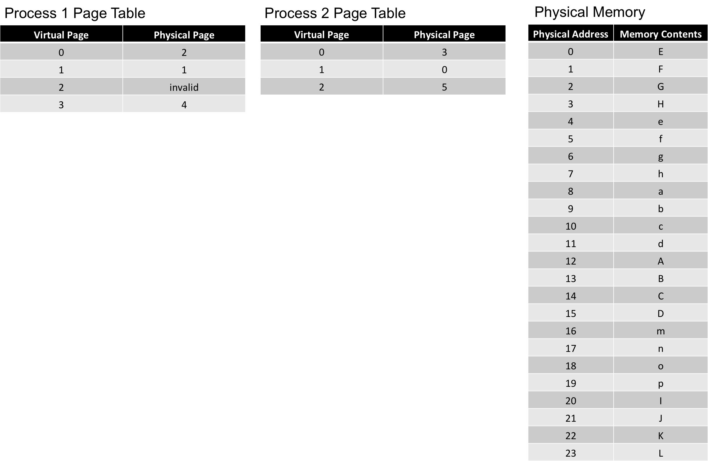

## Implementation Notes
- Virtual page frames are always in order starting at 0
    - No need to store virtual page numbers in page table (just store physical page numbers in order)
- Techinically we don't "store" addresses either

## Implementation Notes
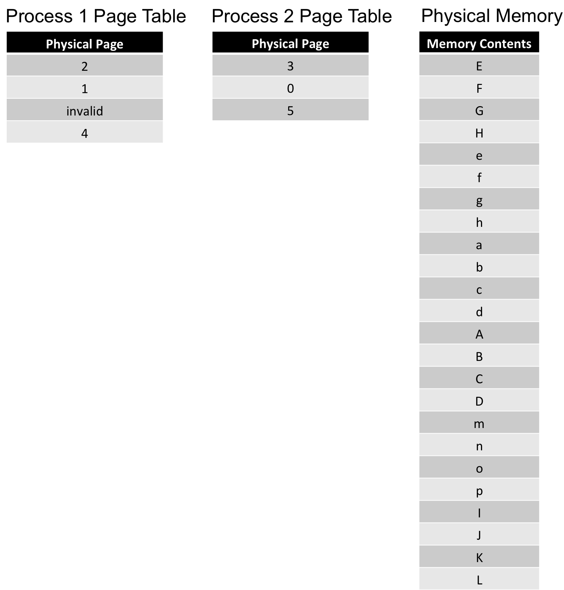

## Implementation Notes
<!--
 2 bits are required to store 4 virtual pages indexes
 2 bits are required to store 4 possible offsets in each page
-->
- If our page table stores 4 virtual pages mappings how many bits do we need to represent each page?
- If our page size is 4 words, how many bits do we need to represent each possible page offset?

## Implementation Notes
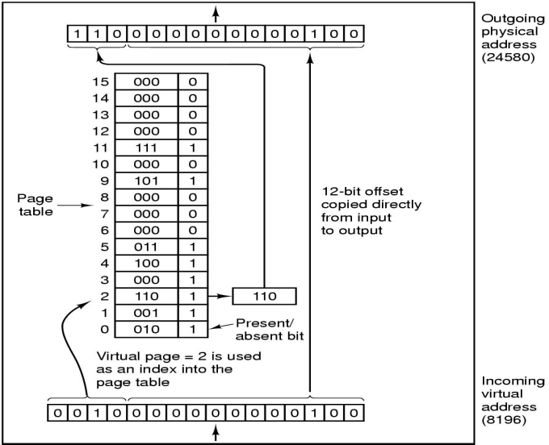

# Page Faults

## Page Fault
What happens if the required page is not in memory?

"Page-fault" trap is initiated, OS gets control

 1. Find a free page frame
 2. Read the desired page from disk into memory
 3. Modify the page tables
 4. Restart the interrupted instruction

## OS Issues
 - Fetch policy - when to fetch pages into memory?
 - Placement policy - where to place pages?
 - Replacement policy
 - All combined in the handling of a page fault

## A Simple Paging Scheme
Fetch policy

 - start process off with no pages in primary storage
 - bring in pages on demand (and only on demand)
    - this is known as demand paging

Placement policy

 - it doesn't matter - put the incoming page in the first available page frame

Replacement policy

 - replace the page that has been in primary storage the longest (FIFO policy)

## Improving the Fetch Policy
<!---
Idea: Bring in more pages than just used to hopefully trigger less page faults later.
-->
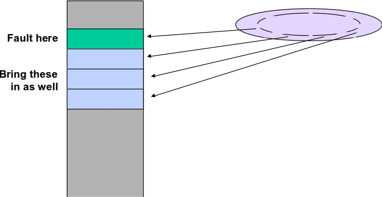

# Page Replacement

## Improving the Replacement Policy
 - When is replacement done?
    - doing it "on demand" causes excessive delays
    - should be performed as a separate, concurrent activity
 - Which pages are replaced?
    - FIFO policy is not good
    - want to replace those pages least likely to be referenced soon

## The "Pageout Daemon"
<!---
Daemon keeps track of in use pages.  If a page needs to be cleared, the pageout daemon will clear it.
If necessary (when modified=1), we will write the page to disk before clearing.
-->
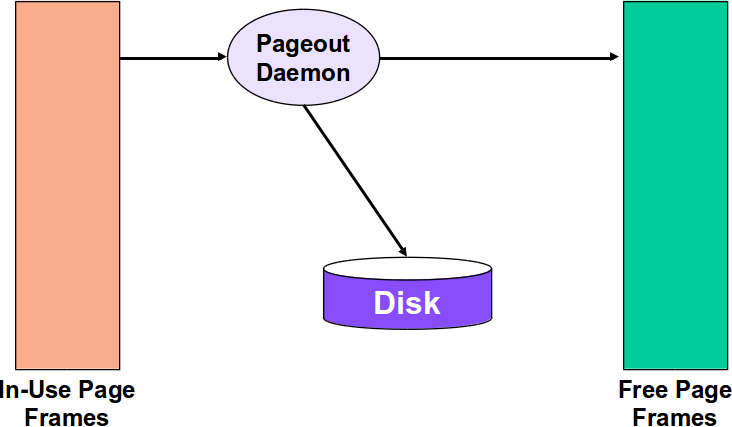

## Page Replacement

Problem Statement:

 > A page is being brought into memory which has no free space. Which page should we replace to make space?

## Page Replacement - Mental Exercise
<!---
Ideal: Remove page that will be used longest in future (or never again)
-->
> - What is the optimal policy, if we had the knowledge of the future page requests
> - Policy: Choose the page which will be referenced farthest in the future
> - However, we don't know the future
    - Hope that the next few references will be for pages that were recently referenced
> - What's the use of knowing about this policy?
    - Will help us access the performance of a real algorithm

## Choosing the Page to Remove
Policies:

 - FIFO (First-In-First-Out)
 - NRU (Not-Recently-Used)
 - Second Chance
 - LRU (Least-Recently-Used)
 - Clock Algorithm(s)
 - Working Set Algorithm

Two issues:

 - How good is the decision?
 - Overhead?
    - Cost per memory access - should be very small
    - Cost per replacement - can be larger

## FIFO
<!---
First in, first out.
-->
Example: 8 pages, 4 page frames

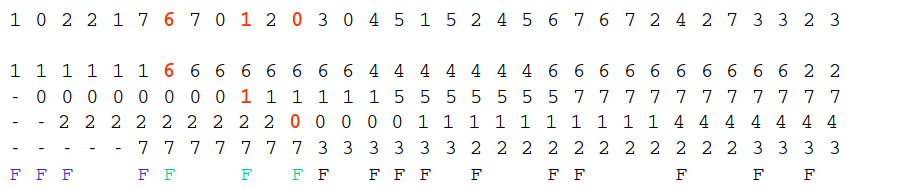

Hit ratio: 16/33

## Help from Hardware
For each page frame:

 - Referenced Bit(R) - 1 if page frame has been referenced recently
 - Modified Bit(M) - 1 if page has been modified since it has been loaded
    - Also known as "dirty bit"

## Not Recently Used Algorithm (NRU)
Pages are classified into 4 classes:

 - Class 0: not referenced, not modified (R=0, M=0)
 - Class 1: not referenced, modified (R=0, M=1)
 - Class 2: referenced, not modified (R=1, M=0)
 - Class 3: referenced, modified (R=1, M=1)

NRU removes page at random from lowest number non empty class

The R bit is cleaned periodically (based on a timer)

## Second Chance
 - Based on FIFO
 - Old pages are inspected for replacement
    - But are given a "second chance" if they have been used recently

## Second Chance Algorithm
<!---
If all pages referenced, degenerates into pure FIFO
-->
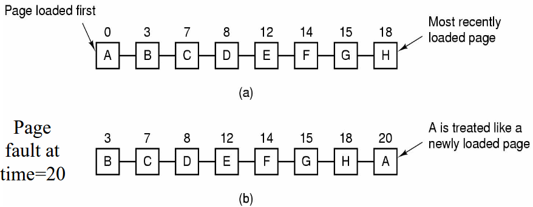

 - Pages sorted in FIFO order (time of arrival)
 - If earliest page has R=1, then give it a second chance by moving it to the end of the list

## Clock Algorithm - Another Implementation of Second Chance
<!---
Exact same idea as second chance, but doesn't do a lot of inefficient moving of pages
-->
 - Order pages in circular list
 - "Hand" of the clock points to the page to be replaced currently
 - When required to evict a page
    - If page pointed to has R=0, then evict it
    - If R=1, then reset R and move hand forward
 - Clock algorithm can be used with NRU (decision based on both R and M bits)

## Least Recent Used (LRU)
 - Replace the page in memory which has been unused for the longest time
 - \structure{Locality of Reference:} pages used in the near past will be used in the near future
    - True in typical cases

## Least Recently Used (LRU)
Example: 8 pages, 4 page frames

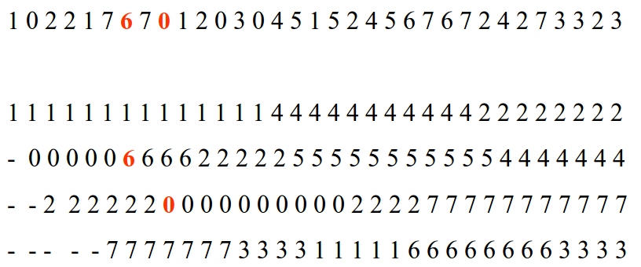

## LRU Implementation
<!---
Can also work in hardware with special counter registers
-->
> - Think of how you would implement it

> - One possible implementation:
    - list of pages, most recently used at front, least at rear
    - update this list every memory reference
    - when required to evict a page, choose the one at the rear of the list
  
> - Way too expensive!

## Not Frequently Used (NFU)
<!---
Problem? Something used a lot at the beginning but not anymore will stick around too long.
-->
 - Requires a software counter associated with each page, initially zero
 - At each clock interrupt, OS scans all the pages in memory
 - For each page, the R bit is added to the counter
 - The page with the lowest counter is chosen

## Aging - Approximating LRU
<!---
Counters shifted right 1 bit before the R bit is added in.  Then R bit added to leftmost rather than rightmost. (Basically a shift register)
-->
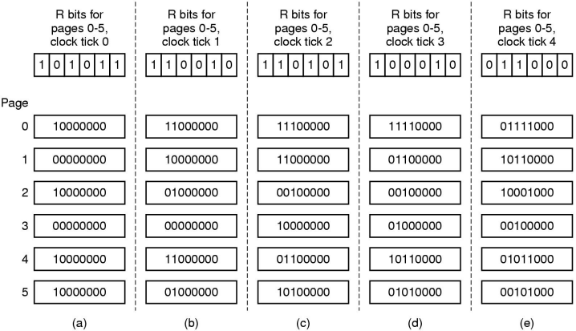

## Example
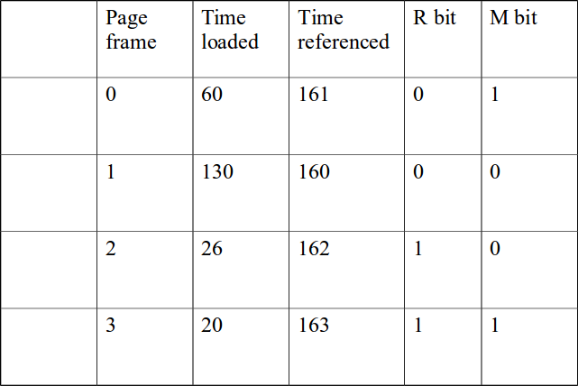

## Questions:
Which page frame will be replaced?

> - FIFO
    - PFN 3 since loaded longest ago at time 20
> - LRU
    - PFN 1 since referenced longest ago at time 160
> - Clock
    - Clear R in PFN 3 (oldest loaded), clear R in PFN 2 (next oldest loaded), victim PFN is 0 since R=0
