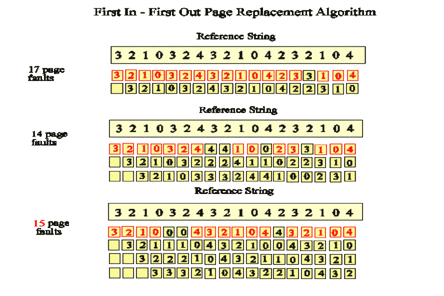

% Lecture 32 -  Memory Management Issues
% CprE 308
% April 2, 2014

# Intro

## Overview
Ideal World (for the programmer):

 - I'm the only process in the world
 - I have a huge amount of memory at my disposal

Real World

 - Many processes in the system
 - Not enough memory for them all

**Goal:** Present the ideal world view to the programmer, yet implement it on a real system

## Today's topics
Memory Management Issues:

 - Page frame allocation
 - Thrashing
 - Working set
 - Belady's Anomaly

Speeding up Page Table Lookups

 - Page table caches

# Memory Management Issues

## Memory Management Issues
 - Fetch policy - when to fetch pages into memory?
 - Placement policy - where to plae pages?
 - Replacement policy
 - \structure{Page Frame Allocation}

## Page Frame Allocation: Global vs. Local
**Global Allocation**

 - All processes compete for pages from a single pool
    - Don't have to desired how many pages go to different processes
    - High priority processes might get pages of lower priority processes

\pause

**Local Allocation**

 - each process has its own private pool of page frames
    - Equal allocation: processes get equal number of page frames
    - Proportional allocation: number of page frames proportional to size of virtual memory used

## Thrashing
 - Consider a system that has exactly two page frames:
    - process A has a page in frame 1
    - process B has a page in frame 2
    - process B faults; the page in frame 1 is removed
    - process A resumes execution and faults again; the page in frame 2 is removed
    - ...
 - The process spends most of the time waiting for disk reads
 - A program causing page faults every few instruction is said to be *thrashing*

## Working Set
<!---
w(k,t):
 - t: time instance
 - k: all pages used by k most recent memory references
Perhaps draw example on board?
1 2 1 1 3 2 1 4 5 1 1 1 1 3 1
calculate w(k,t) at time t=15
Show graph from page 210

Basic idea of algorithm: find page not in working set
 - WSClock algorithm

See book for more details
-->
 - \structure{Locality of reference:}
    - During a phase of execution, a process references only a relatively small fraction of its pages.
 - \structure{Definition:} the **Working Set** of a process is the set of referenced pages in the last $k$ memory references
 - Each process should have the working set in memory
    - Keep track of working set
    - Make sure the process' working set is in memory before letting the process run -> loading the pages before letting it run -> prepaging
    - Reduce the page fault rate, avoid thrashing this way

## Belady's anomaly
<!---
Idea: Lots of page frames isn't always better.
-->

# TLB 

## Performance
 - Address translation is done on every memory reference
 - Maybe twice per instruction
    - Instruction fetch
    - Fetch Memory operand
 - Translation better be fast!

## Where do Page Tables Go?
 - Registers
    - Fast translation
    - Can be used for small page tables (a few 10s of entries)
 - Context Switch is quite expensive: reload new page translations into registers

## Where do Page Tables Go?
<!---
Starting point for optimizations
-->
 - Memory
    - Slow translation
    - Large tables can be stored
 - The page-table base register (PTBR) holds a pointer to the page table location
 - **Page-table length register** (PTLR) indicates size of the page table
 - Context Switch is quick - only need to change this register
 - Currently used in most systems, because of the large page tables
 - Problem: Cannot afford a memory access for each translation
    - 4 memory in total for an instruction involving memory operands!

## Faster Translations
 - Translation Lookaside Buffer (=Page Table Cache)
 - Frequent translations found in the high-speed cache - TLB hit
 - Rest will go to slower-speed memory - (TLB miss)

## Associative Register
Associative registers - parallel search

Address translation ($A',A''$)
 - If $A'$ is in associative register, get frame # out
 - Otherwise get frame # from page table in memory
    - This is done by the OS, and takes some time

## TLBs - Translation Lookaside Buffers
<!---
This might be generated by process with loop spanning pages 19,20,21, with data in 129,130; 140.  Stack on 860/861.
-->

 - Speeds up paging by caching recent address translations
 - Typically small size - a few 10s of entries
 - TLB Hit rates are very important for performance

## TLB = Associative Memory
Given a virtual address, check all the TLB locations simultaneously for a hit

 - requires expensive hardware

Usually between 64-1024 entries

Multiple address spaces

 - TLB contains translations for only one address space at a time
    - TLB flushed on every context switch
 - Contains translations for all address spaces simultaneously
    - Each entry should have an identifier for the address space

## TLB impact on AAT
<!---
Also assume no page fault
-->
 - Associative Lookup = $\epsilon$ time unit
 - Assume memory cycle time is $m$ microsecond
 - Hit ratio - percentage of times that a page number is found in the associative registers
    - hit ratio related to number of associative registers
 - Hit ratio = $\alpha$
 - Average Access Time (AAT):
\begin{equation*}
AAT = \alpha (m + \epsilon) + (1 - \alpha)(2m + \epsilon)
    = 2m + \epsilon - \alpha m
\end{equation*}

## Impact of TLB on Performance
TLB hit ratio = percent of time a translation can be found in the TLB

**Example:**

 - 80 percent hit ratio
 - TLB search = 20 nsec
 - Memory access = 100 nsec
 - Effective memory access time = ?

\pause

**Answer:**
0.8(120) + 0.2(220) = 140 nsec

# Page Table Size

## Topics
 - Handling large page tables
    - Multi-level page tables
    - Inverted page table
 - `vfork()` and Copy-on-Write
 - Page Size

## Page-Table Size

Consider a full $2^{32}$-byte address space

 - assume 4096-byte ($2^{12}$-byte) pages
 - 4 bytes per page table entry
 - the page table would consist of $2^{32}/2^{12} = 2^{20}$ entries
 - its size would be $2^{22}$ bytes (or 4 megabytes)

Imagine $2^{64}$-byte address space

## One Solution
 - Put the page tables themselves in virtual memory
 - Only the currently active translations are in physical memory

## Multi Level Page Tables

## Multi Level Page Tables

## Multi Level Page Tables

## Multi Level Page Tables

## Space Efficiency
<!---
For instance, text, data, and stack at very top.
-->

## Multi Level Page Tables
 - What about page access times?
    - Even for successful address translations, 3 memory accesses
    - 3 fold slowdown is unnacceptable
 - Hope that the TLB hit ratio is large enough

## Inverted Page Tables
<!---
Think of 64 bit address space - need 2^52 entries for 4KB pages.  With 8 byte entries, 30 million GB (30 PB) page table.  Per process.

Idea: Page table only lists pages in physical memory.  When you need to get a page, you search for the whole page table for correct entry.

Can combine with TLB to improve.

OR:  Hash tables.
-->

## Unix and Virtual Memory: The `fork/exec` Problem

Naive implementation:

 - `fork()` actually makes a copy of the parent's address space for the child
 - child executes a few instruction (setting up file descriptors, etc.)
 - child calls `exec()`
 - result: a lot of time wasted copying the address space, though very little of the copy is actually used

## `vfork()`
 - A new system call `vfork()`:
    - Don't make a copy of the address space for the child, instead give the address space to the child
    - Parent suspended until the child returns it
    - The child immediately does an `exec`: as part of the `exec`, the address space is handed back to the partent
 - Advantages
    - very efficient
 - Disadvantages
    - works only if child does an `exec` (programmer has to be careful)
    - child shouldn't do anything to the address space

## Alternative Solution: Copy on Write (1)

## Copy on Write (2)

## How does Copy on Write Work?
 - Shared page is marked Copy on Write in the pages tables
 - When a process attempts to write
    - Page fault causes a trap
    - Fault handler makes a copy of the page
    - Page Tables changed for both processes
 - Advantage: May not need to make the copies at all

## Page Size
 - Usually 4KB or greater
 - Two large - internal fragmentation
    - Half of the last page is probably wasted
 - Two small - number of pages increase
    - Larger page table
    - Greater overhead in transferring to/from disk

