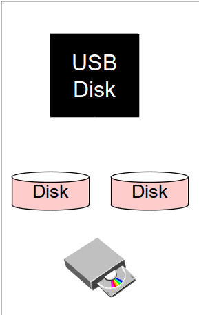
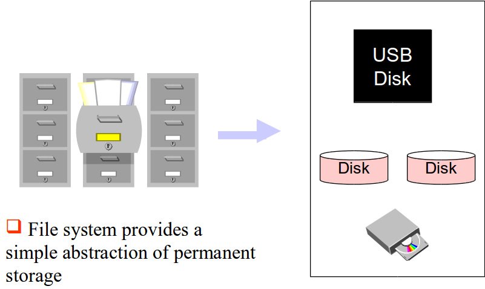
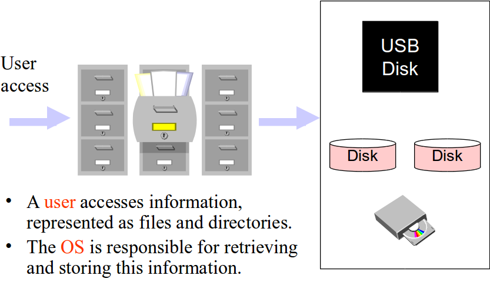
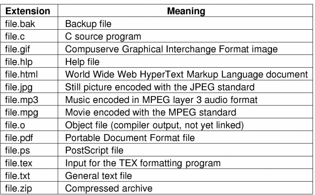
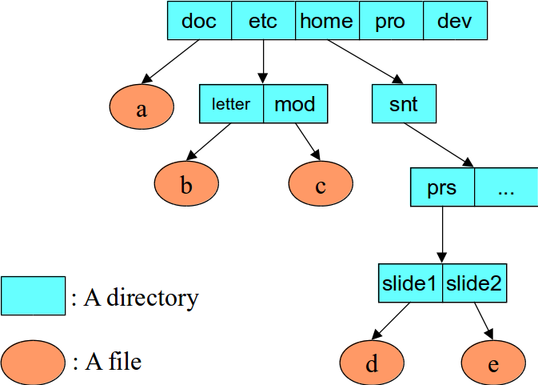

% Lecture 34 -  File Systems
% CprE 308
% April 7, 2014

# Intro

## File System

 - User View
 - Programming Interface
 - File System Implementation

## Permanent Storage

## Files

## File System

## Roles of OS
Two important tasks of an operating system

 1. Provides easy interface to hardware
 2. Manages resources

## Requirements
 - Permanent storage (usually)
    - resides on disk (or alternatives)
    - survives software and hardware crashes
 - User access
    - Regular users
    - Programmers (convenient programming interface)

## User View of a File System
**File Naming**

 - Usually ASCII characters, with extensions.  E.g. \structure{myprog.c}

**Unix:**

 - Case is important "\structure{abc}" different from "\structure{aBc}"
 - OS does not use filename extensions
    - Programmers might use them

**Windows:**

 - Case insensitive names
 - OS uses extensions to determine which programs to use to open the file
    - Ex: Clicking on "\structure{milefile.doc}" opens up Microsoft word

## File Naming

Typical file extensions

## Hierarchical directory structure

 - What about user interface for this structure?

## Types of Unix Files

**Data Files:**

 - ASCII files - lines of text
    - Special programs to handle these (`wc`, `grep`)
 - Binary Files
    - Non ASCII characters (executable code, archive, .dvi, .pdf)

**Directories:**

 - special files whose data contains a list of files

**Special Files:**

 - Point to I/O devices

## Special Files

    ls -l /dev
    crw-------    1 root  root   10,  3 Apr 11  2002  atimouse
    crw-------    1 root  root   14,  4 Apr 11  2002  audio
    crw-------    1 root  root   14, 20 Apr 11  2002  audio1
    crw-------    1 root  root   14,  7 Apr 11  2002  audioctl
    brw-rw----    1 root  disk   29,  0 Apr 11  2002  aztcd

 1. Character Special Files (terminal, network device, etc.)
    - The device is abstracted by a stream of bytes that can only be accessed in sequential order.
 2. Block Special Files (disks)
    - The device driver transfers chunks or blocks of data between the operating system and the device.
 
## File Attributes
 - Information about the file, but not a part of the file data
    - Protection (or permissions)
    - Owner
    - Time of creation
    - Current Size
    - Etc..
 - Examples (in Unix)

        -rw-r--r--  1 snt  users  443529 Sep 25 13:49 switching-networks.ps
        drwxr-xr-x  4 snt  users      53 Oct  7 20:07 streams

## Unix System Calls for Files
 - `int open(const char *pathname, int flags, mode_t mode);`
    - Returns a file descriptor
 - `ssize_t read(int fildes, void *buf, size_t count);`
    - Use the file descriptor
 - `ssize_t write(int fildes, const void *buf, size_t count);`
    - Use file descriptor
 - `off_t lseek(int fildes, off_t offset, int whence);`
    - Use file descriptor
 - Delete, read attributes, set attributes, etc.

## The `open()` call

    #include <sys/tyles.h>
    #include <sys/stat.h>
    #include <fcntl.h>
    int open (const char *path, int flags, [mode_t mode]);

 - `char *path`: is a string that contains the *fully qualified filename* of the file to be opened
 - `int flags`: specifies the method of access i.e. *read_only* (O_RDONLY), *write_only* (O_WRONLY), *read_and_write* (O_RDWR).
 - `mode_t mode`: optional parameter used to set the access mode upon file creation (e.g. O_TRUNC, O_APPEND, ...)

## `read()` and `write()`

    #include <fcntl.h>
    ssize_t read(int filedes, void *buffer, size_t n);
    ssize_t write(int filedes, const void *buffer, size_t n);

 - `int filedes`: file descriptor that has been obtained though an `open()` or `create()` call.
 - `void *buffer`: pointer to an array that will hold the data that is read or holds the data to be written.
 - `size_t n`: the number of bytes that are to be read/written from/to the file.

## An example

    #include <fcntl.h> 
    #include <unistd.h>
    main() { 
        int fd;   /* a file descriptor */
        ssize_t nread;  /* # of bytes read */
        char buf[1024]; /* data buffer */
        /* open the file “data” for reading */
        fd = open(“C:/mydata.dat”, O_RDONLY);
        /* read in the data */
        nread = read(fd, buf, 1024);
        /* close the file */
         close(fd);
    }

## A `close()` call
 - Although all open files are closed by the OS upon completion of the program, it is *good programming style* to "clean up" after you are done with any system resource. 
 - Please make it a habit to *close* all files that you program has used as soon as you don't need them anymore!

        #include <fcntl.h>
        int close(int filedes);

 - Remember, closing resources timely can improve system performance and prevent deadlocks from happening (more later)

## Random Access

    #include <sys/types.h>
    #include <unistd.h>
    off_t lseek(int fd, off_t offset, int whence)

 - sets the file pointer for fd:
    - if *whence* is SEEK_SET, the pointer is set to *offset* bytes;
    - if *whence* is SEEK_CUR, the pointer is set to its current value plus *offset* bytes;
    - if *whence* is SEEK_END, the pointer is set to the size of the file plus *offset* bytes
 - it returns the (possibly) updated value of the file pointer relative to the beginning of the file. Thus, `n = lseek(fd, (off_t)0, SEEK_CUR);` returns the current value of the file pointer for fd

## Standard File Descriptors

    main( ) {
        char buf[100];
        int n;
        const char* note = "Write failed\n";
        while ((n = read(0, buf, sizeof(buf))) > 0)
            if (write(1, buf, n) != n) {
                (void)write(2, note, strlen(note));
                exit(EXIT_FAILURE);
            }
        return(EXIT_SUCCESS);
    }

 - File descriptor 0: standard input
 - File descriptor 1: standard output
 - File descriptor 2: standard error output
