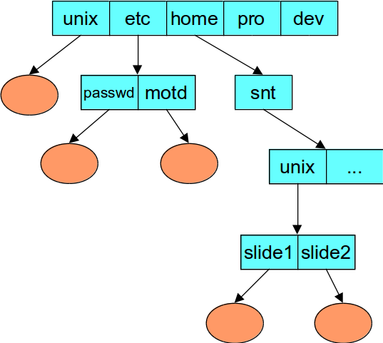
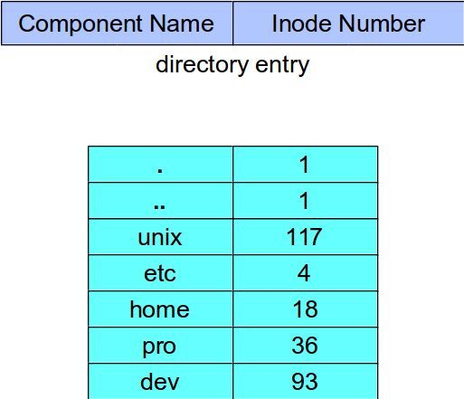
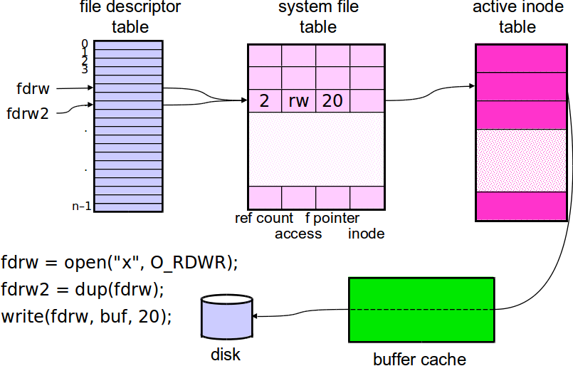
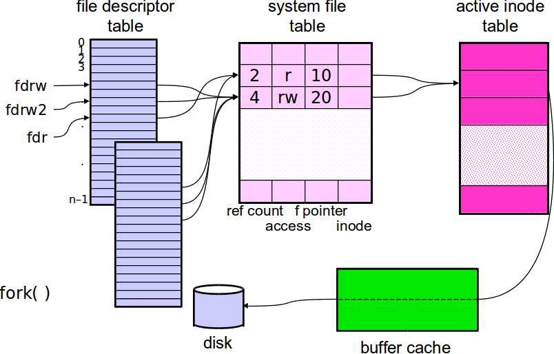

% Lecture 35 -  File Systems
% CprE 308
% April 7, 2014

# Intro

# Directories

## Unix Directories


## Directory Representation


# Open File

## Representing an Open File (1)


## Allocation of File Descriptors
 - Whenever a process requests a new file descriptor, the lowest numbered file descriptor not already associated with an open file is selected.

## Representing an Open File (2)
<!---
(Book page 793)
Why not just point directly to the active inode?
 - every fd has file position.
Where to store file poistion - in i-node table?
 - No, if two or more unrelated processes open same file, each has own file position.
Why not store directly in file descriptor table?
 - Obscure example of forking shell script


-->


## Reading From a File
```c
#include <sys/types.h>
#include <unistd.h>
ssize_t read(int fd, void *buffer, size_t n)
```

 - read up to n bytes of data into buffer
 - returns number of bytes transferred
 - returns 0 on end of file
 - returns –1 on error

\pause

When will “read” transfer fewer bytes than specified ?

## Writing To a File
```c
#include <sys/types.h>
#include <unistd.h>
ssize_t write(int fd, void *buffer, size_t n)
```

 - write up to n bytes of data from buffer
 - returns number of bytes transferred
 - returns –1 on error

## Example
```c
main( ) {
    char buf[BUFSIZE]; int nread;
    const char* note = "Write failed\n";
    while ((nread = read(0, buf, sizeof(buf))) > 0) {
        int bytes_left = nread; int bpos = 0;
        while ((n = write(1, &buf[bpos], bytes_left)) < bytes_left) {
            if (n == -1) {
                write(2, note, strlen(note));
                exit(EXIT_FAILURE);
            }
            bytes_left -= n; bpos += n;
        }
    }
    return(EXIT_SUCCESS);
}
```

## Random Access
```c
#include <sys/types.h>
#include <unistd.h>
off_t lseek(int fd, off_t offset, int whence)
```

 - sets the file pointer for fd:
    - if *whence* is SEEK_SET, the pointer is set to *offset* bytes;
    - if *whence* is SEEK_CUR, the pointer is set to its current value plus *offset* bytes;
    - if *whence* is SEEK_END, the pointer is set to the size of the file plus *offset* bytes
 - it returns the (possibly) updated value of the file pointer relative to the beginning of the file. Thus, `n = lseek(fd, (off_t)0, SEEK_CUR);` returns the current value of the file pointer for fd

## `lseek` Example
<!---
Sort of a trick question.  Nothing.  Seek should be -2.
-->
 - What does this piece of code do?

```c
fd = open("textfile", O_RDONLY); 
fptr = lseek(fd, (off_t)-1, SEEK_END);
while (fptr != -1) {
    read(fd, buf, 1);
    write(1, buf, 1); 
    fptr = lseek(fd, (off_t)-1, SEEK_CUR);
}
```

\pause

Should be: `fptr = lseek(fd, (off_t)-2, SEEK_CUR);`

# Multiple Descriptors

## Representing an Open File (3)


## Multiple Descriptors; One File
 - How are standard file descriptors set up?
    - suppose 1 and 2 are opened separately

```c
while ((n = read(0, buf, sizeof(buf))) > 0)
    if (write(1, buf, n) != n) {
    (void)write(2, note, strlen(note));
    exit(EXIT_FAILURE);
}
```

 - error message clobbers data bytes!

## `dup` System Calls
 - `dup` returns a new file descriptor referring to the same file as its argument
    - `int dup(int fd)`
 - `dup2` is similar, but it allows you to specify the new file descriptor
    - `int dup2(int oldfd, int newfd)`

## `dup` Example
```c
/* redirect stdout and stderr to same file */
/* assumes file descriptor 0 is in use */
close(1);
open("file", O_WRONLY|O_CREAT, 0666);
close(2);
dup(1);

/* alternatively, replace last two lines with: */
dup2(1, 2);
```

## Representing an Open File (4)


## Representing an Open File (5)


## I/O Redirection
`% who > file &`

```c
if (fork( ) == 0) {
    char *args[ ] = {"who", 0};
    close(1);
    open("file", O_WRONLY|O_TRUNC, 0666);
    execv("who", args);
    printf("you screwed up\n");
    exit(1);
}
```
