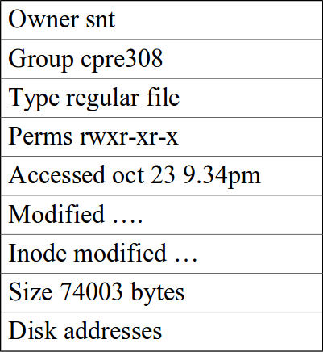
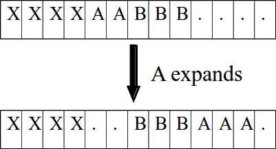
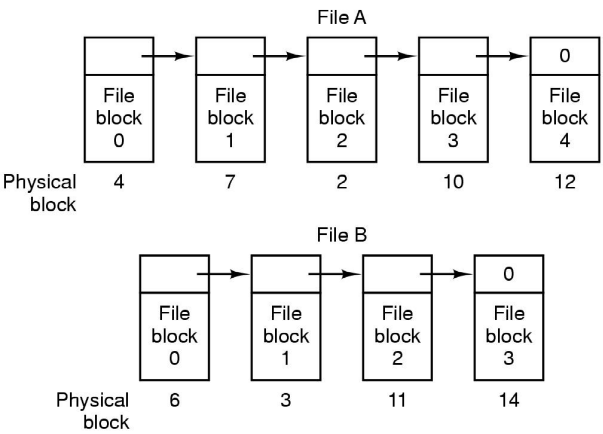
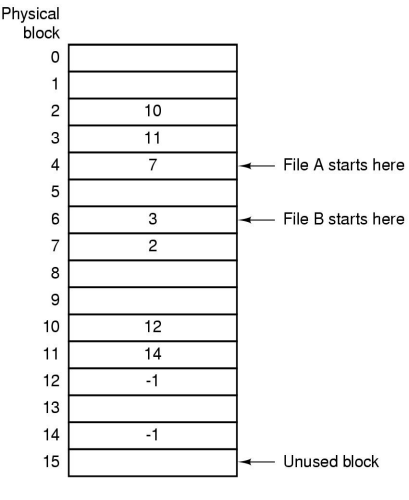
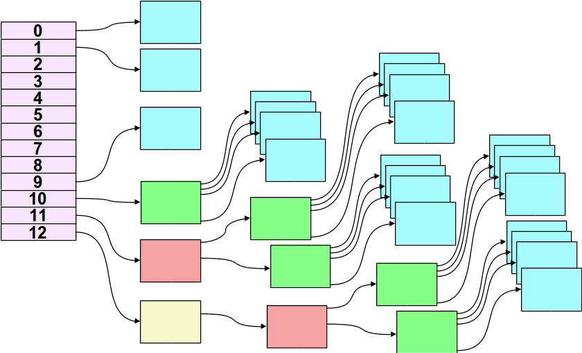
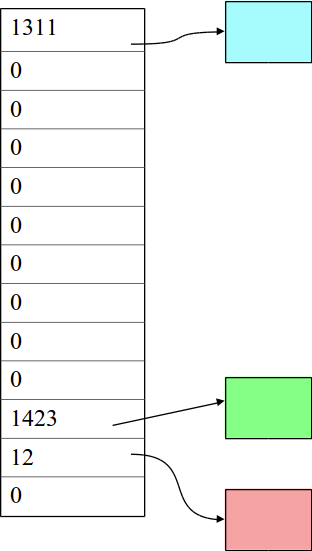
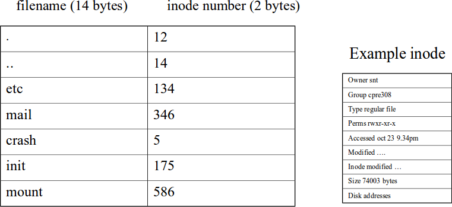
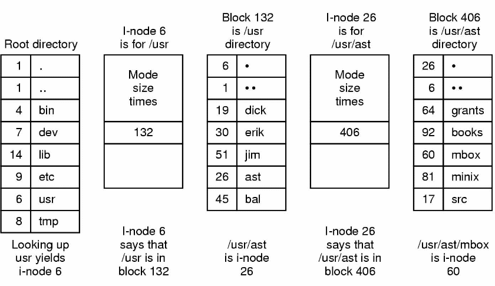

% Lecture 36 -  File Systems
% CprE 308
% April 7, 2014

# Intro

## Todays topics: File SYstem Implementation

 - Data Structures for files
 - Unix files, Inodes

# Inodes

## Unix File System - Inodes

### 

####

 - data structure on disk
 - one inode per file

####

## Problem

 - Disk = (long) sequence of block
 - Keep track of the blocks associated with a file

## Contiguous Allocation

###

####

 - All disk blocks of a file allocated sequentially
 - Advantages
    - (very) Fast read
    - Useful for read-only file systems (CD-ROM)
    - Keeping track of blocks of a file is easy
 - Problems
    - Fragmentation with deletes
    - File growth might be expensive

####

## Linked List of Blocks

Sequential access is fast, random access is slow

## File Allocation Tables (FAT)

###

####

 - One entry per physical disk block;
 - FAT can be in main memory

####

## Disk Map in Unix

## Optimization for Sparse Files
###
####
 - Suppose a file was large, but mostly zeros
 - Could be produced using lseek and write

####

## Additional Enhancements
 - Performance depends on: How many disk access are needed to read a file?
 - Store some data in the inode itself
    - Perhaps the whole file will fit in!
    - Need only 1 disk access for a small file
 - Increase block size

## File Systems
 - Data Structures for Directories
 - Shared Files

## Unix Directory (V7)
Directories are files whose data is a list of filenames & inodes

Max filename size = 14 chars

## The UNIX V7 File System

The steps in looking up `/usr/ast/mbox`
