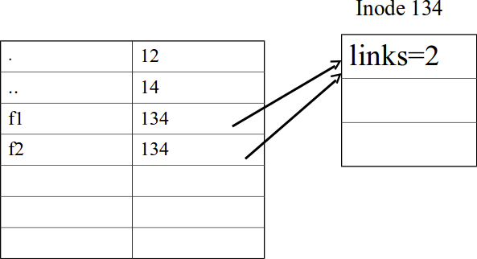
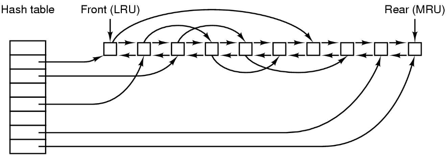
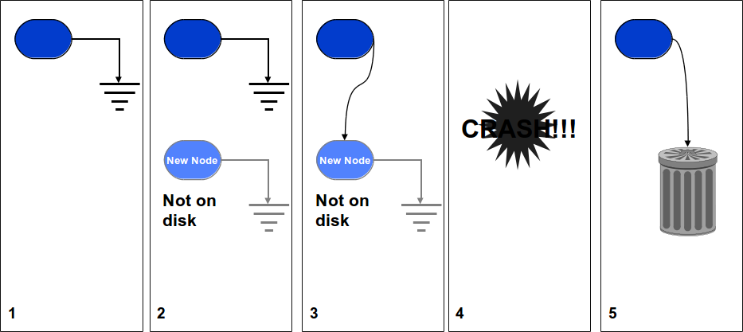

% Lecture 37 -  File Systems: Shared Files, Performance
% CprE 308
% April 14, 2014

# Intro

## Todays topics: File System Implementation

 - Shared Files
 - Buffer Cache and File System Consistency

# Sharing

## Sharing of Files
 - In UNIX: `ln src dest`
 - Two ways of linking files
    - "hard" links
    - Symbolic links

## Hard links
 - Both files point to the same inode
 - `ln /home/guan/f1 /home/guan/f2`

## Hard Links
<!---
Removal: C can 'delete' it, but it still exists to user B.
May be good or bad depending on how you want it.
-->

## Symbolic links
<!---
If owner deletes it, file is truly destroyed.  Second user will not be able to use it because system can't find the file.

Also, overhead of symbolic link because you have to follow the full path.
-->
 - Files point to different inodes
 - `ln -s /home/guan/f1 /home/guan/f2`

# Performance

## Performance of File System
 - Where does your data go after a `write()` system call?
 - Where does the data come from for a `read()`?
 - Think about performance

## The Buffer Cache

## Buffer Cache
`Read(block)`

 1. See if block present in buffer cache
    - If yes, then return buffer
 2. Initiate disk read for the block
 3. Sleep till read is complete
 4. Return buffer

## Read Ahead
<!---
Computer may intelligently decide if reading in "sequential access mode" or "random access mode" to see if it should continue doing it.  If random access, then reading ahead is not helpful (and actually hurtful).
-->

## Buffer Cache - Write
<!---
Write-back on UNIX, write-through on old Windows.
-->
`Write(block) // assume block in cache`

 - (Usually) Write to cache and return; the write to disk is done later \structure{(write-back cache)}
 - (Sometimes) Write to cache, schedule a write to disk and return \structure{(write-through cache)}
 - (Exceptional cases) Write to cache, do a synchronous (blocking) write to disk, and return

## Write
 - Write-back more efficient than write-through
 - A disk crash might cause a more serious problem with write-back
 - What happens when:
    - The system is turned off without a shutdown
    - A floppy is removed from the drive without unmounting
 - System to the rescue: Every 30 seconds or do, a `sync` is done, writing all cache contents to disk

## Structure of Cache
 - Memory allocated by the system
 - Lookup:
    - hash tables
 - Page Replacement:
    - LRU
    - Keep a list sorted according to time of use

## Structure of the Cache

## File-System Consistency (1)

## File-System Consistency (2)

## Keeping It Consistent
<!---
Point, sometimes things get messed up - check!
Also, journaling file systems.

In practice, use modified LRU.  Put blocks to use again near end
-->

## File Systems do Crash
 - Bring to a consistent state using `fsck` on Unix
 - Make sure every disk block in exactly one file or on the free list
 - Go through all directories, and count the number of links per file - check for inconsistencies
 - Might prompt the user before taking action

## Log Structured File Systems
<!---
Introduce to show variety, and options.
Mention cleaner - like circular buffer.
Way better for lots of short writes, and as good for reading and long writes.  However, still complex and not compatible with existing file systems so not widely used.
-->
 - If there's lots of caching, then most operations to the file system are *writes*
 - Writes are quickest when there is no need to do a seek
 - Thus: perform writes wherever the disk head happens to be

