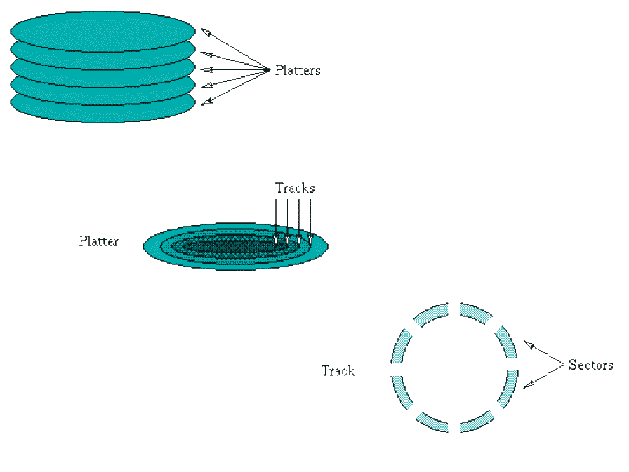

% Lecture 38 -  File Systems: Disk Scheduling
% CprE 308
% April 16, 2014

# Intro

## Todays topics:

 - Disk Scheduling (Section 5.4.3)

# Disk Scheduling

## Disk Scheduling
 - In multiprogramming systems several different processes may want to use the system's resources simultaneously.
 - The disk drive needs some mechanism to resolve this contention, sharing the resource between the processes fairly and efficiently.

## Disk Parts

## Disk schduling goals
 - In order to satisfy an I/O request the disk controller must first move the head to the correct track and sector.
 - Maximize the number of I/O requests
 - Minimize the movement of the head.

## Disk scheduling goals
 - trade-off between \structure{throughput} (the average number of requests satisfied in unit time)
 - and \structure{response time} (the average time between a request arriving and it being satisfied)
 - Disk Scheduling Policies

## FCFS
 - The disk controller processes the I/O requests in the order in which they arrive
 - This policy aims to minimize response time with little regard for throughput
 - The head may move almost randomly across the surface of the disk

## Practice
 - Assume that a disk has 100 cylinders labeled 0-99.  The read head is positioned over the cylinder 50 moving toward the cylinder 99.  Accessing data requires 5 time units, moving from one cylinder to the next requires 1 time unit.  The incoming requests arrive as follows:
    - Arrive time: 0  15  32  40  55 63  123
    - Cylinder:    10 35  78  92  60 75  40
 - What is the order of the requests which will be serviced by FCFS disk scheduling algorithm?  Each request is labeled by the cylinder it accesses.

## Shortest Seek Time First (SSTF)
 - Each time an I/O request has been completed the disk controller selects the waiting request whose sector location is **closest** to the **current** position of the head.
 - time spent in movement is minimized
 - but a request may be delayed for a long period if many closely located requests arrive just after it

## SCAN
<!---
Works like an elevator.  Keep going until very edge of disk
Upper bound of movement for any collection of requests: twice the number of cylinders.
-->
 - The drive head sweeps across the entire surface of the disk 
 - visiting the outermost cylinders before changing direction and sweeping back to the innermost cylinders 
 - It selects the next waiting requests whose location it will reach on its path backwards and forwards across the disk. 
 - movement time should be less than FCFS
 - the policy is clearly fairer than SSTF

## LOOK
<!---
Difference from SCAN: Stops if nothing left in that direction.
-->
 - Similarly to SCAN, the drive sweeps across the surface of the disk, satisfying requests, in alternating directions. 
 - a sweep out towards the outer edge of the disk will be reversed when there are no waiting requests for locations beyond the current cylinder.

## (Circular SCAN) C-SCAN
 - C-SCAN is similar to SCAN but I/O requests are only satisfied when the drive head is traveling in one direction across the surface of the disk. 
 - Go from the innermost cylinder to the outermost cylinder satisfying the waiting requests 
 - When it reaches the outermost cylinder it sweeps back to the innermost cylinder without satisfying any requests.

