% Lecture 41 -  OS Security
% CprE 308
% April 23, 2014

# Intro

## What have we learned about OS so far?

**OS**

 - Goals
    - Resource Manager
    - User Interface
 - Important things we have discussed
    - Multi-user, multi-process, multi-thread
    - Synchronization, Mutual Exclusion, Deadlock
    - Scheduling
    - Memory
    - I/O Devices
    - Files, and File Systems

## What are the problems?

Top 25 Most Dangerous Software Errors

[http://www.sans.org/top25-software-errors/#cat1](http://www.sans.org/top25-software-errors/#cat1)

Version 3.0, June 2011

# Problems and Fixes

## Problem: Cleartext Transmit/Storage of Sensitive Info
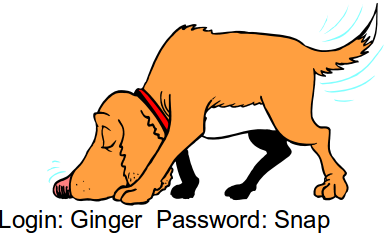

. . .

**Fix:**

 - Encrypt data with standard, reliable encryption before transmission
 - Whole-drive/File Encryption

## Problem: Adopting Untrusted Software

###

####

**Fix:**

 - Use monitoring tools that examine processes as it interacts with the OS
    - Truss (Solaris)
    - Strace (Linux)
    - FileMon, RegMon, Process Monitor, Sysinternals (Windows)
    - Sniffers, Protocol analyzers

#### 
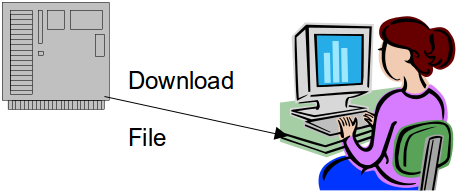

Free Software ... Is it Safe?

## Problem: Incorrect Input
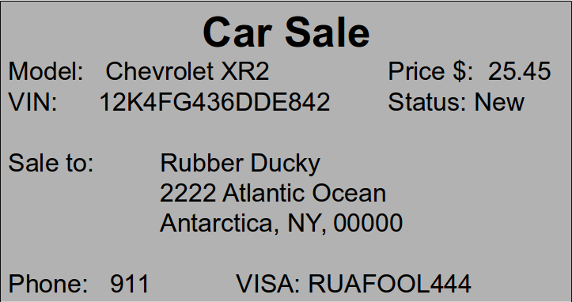

## Problem: Buffer Overflow

###

####
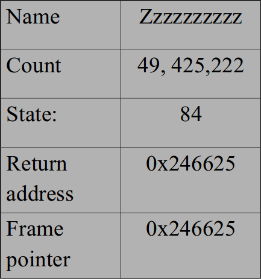

####
Enter Name: Zzzzzzzzzzzzzzzzzzzzzzzzzzzzzzzzzzzzzzzzzzzzzzzzzzzzzzzzzzzzzzz

## Fix: Input Validation
###
####
Assume all input is malicious! Validate:

 - Length
 - Type
 - Syntax
 - Context: Business Rules

Or use:

 - Special input checkers
 - Whitelist: List of acceptable input
 - Blacklist: Reject suspect input

####
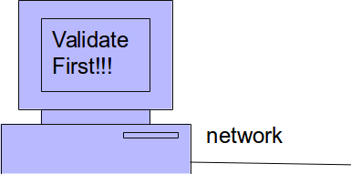

## Problem: Race Condition
Threads both using same variables.

. . .

**Fix:**

 - Use Synchronization Primitives around critical code
 - Measure use of shared resources
 - Test using artificial delays in race window
 - Identify and trigger error conditions

## Problem: OS Command Injection
###
####

Problem: Command Injection into SQL

Inserts `|shell("cmd /c echo " & char(124) & "format c:")|`

  - Data and control can traverse same path
 
####
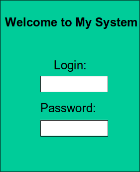

## Fix: Avoid OS Command Injection

 - Separate control information from data information.
    - E.G. where data -> database, control defines application
 - Use library calls instead of external processes
 - Avoid external control of command input
 - Run code in "jail" or other sandbox environment
 - Provide lowest possible permissions for executable

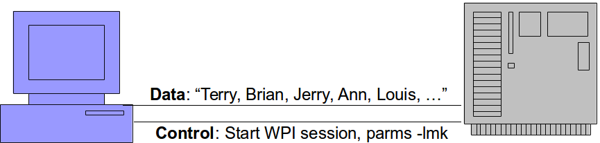

## Problem: External Control of Critical State Data

###
####
User - side data can be modified

 - Cookies
 - Configuration files
 - Profiles
 - Hidden form fields
 - Environmental variables
 - Registry keys

####
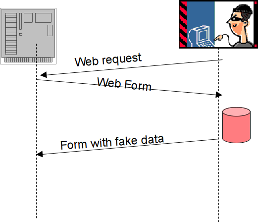

## Fix: Control Critical State Data

 - Understand all locations that are accessible to attackers
 - Do not keep state info on client without using encryption and integrity checking (e.g. HMAC)
 - Store state info on server side only: ASP.NET View State, OWASP ESAPI Session Mgmt

## Problem: Insecure Interaction Between Components
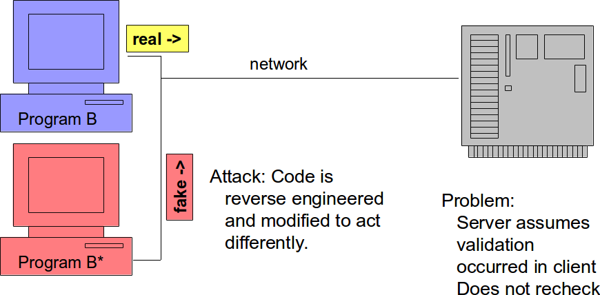


## Problem: Insecure Interaction Between Components

###
####
 - Web servers are memoryless
 - Do not remember sending a form to a client - what type, info
 - Client side can remove checks, insert other code, return unexpected data, etc.

####
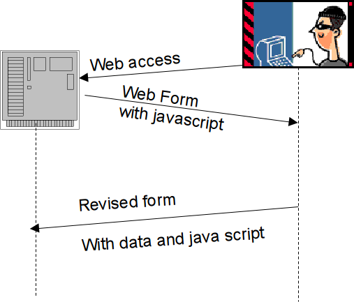

## Problem: Forgery
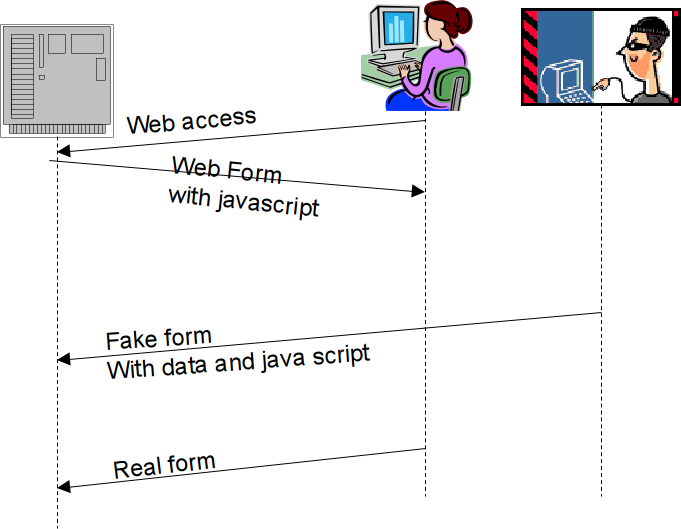

## Fix: Prevent Forgery

###
####
 - Use a nonce for each form
 - Not predictable
 - If dangerous operation, send a separate confirmation request

####
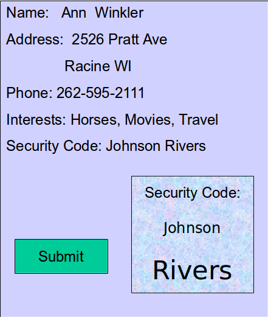

## Problem: Improper Access Control
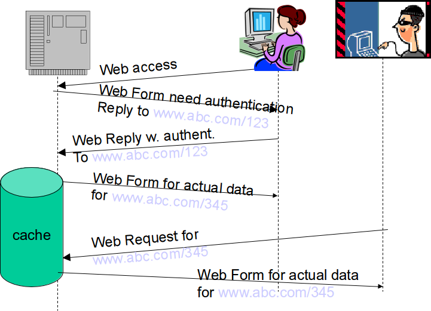

## Fix: Access Permissions
 - Use Role-Based Access
    - At least permissions: anonymous, normal, privileged, administrative
 - Verify access control at server side
 - Sensitive pages are never cached and must have active authorization token
 - Only provide higher level access when you need it; always run with the minimum possible authorization level
 - Check that files read have the required access level permissions; administrators may not set them properly.
 - Use a good random number generator when generating random session keys – if not random, attackers will figure out next key sequence

## Problem: External Control of Path

 - If you download an external file or navigate to a URL - and execute
 - If you provide access to a file on your system
 - Attacker can insert `../../` and access files outside privilege.

**Fix:**

 - Run as low-privilege user
 - Provide fixed input values
 - Run code in 'jail': Unix chroot jail and AppArmor


# Examples

## Problem: Some Security Errors

Find the errors:

```c
Security() {
    String contents, environment;
    String spath = "security.dat"
    File security = new File;
    if (security.open("spath") >0)
        contents = security.read();
        environment = security.read();
    else
        print("Error: Security.dat not found");
}
```

## Problem: Some Security Errors

 1. Variables contents & Environment not initialized
    - Can cause problems if executed in certain ways
    - Attacker can initialize or read variables from previous session
 2. "security.dat" is not full pathname
    - File can be replaced if run from another location
 3. File 'security' not closed
    - Leaves file open to attack
    - Keeps unnecessary resources busy
 4. Error message indicates file name
    - Can give attacker important info

## Problem: More Security Errors
Find the errors:

```c
purchaseProduct() {
    password = "N23m**2d3";
    count = form.quantity;
    total = count * product.cost();
    Message m = new Message(
        name,product,total);
    m.myEncrypt();
    server.send(m);
}
```

## Problem: More Security Errors

 1. Password is hardcoded
    - If attacker find it, every system can be broken into before software is changed on all computers
    - Passwords may only be stored in encrypted file
 2. Total may overflow, producing very small number
    - Input is not checked (could be zero or invalid)
 3. Encryption should be standard algorithm
    - Home-written variety can be broken into easily


