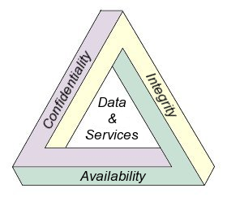
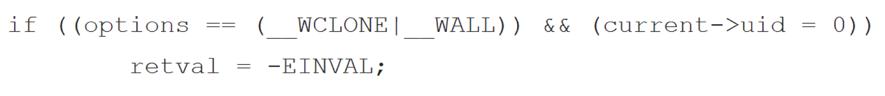
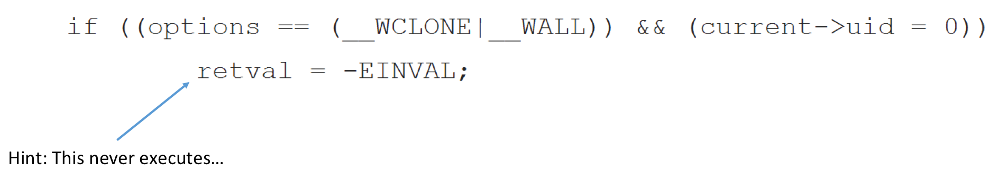
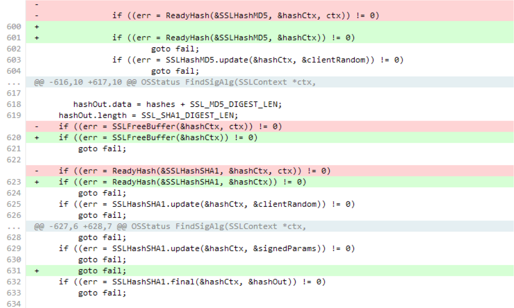
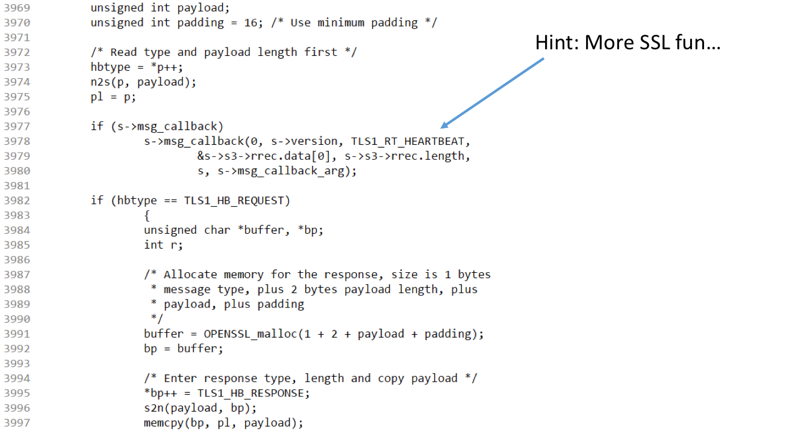
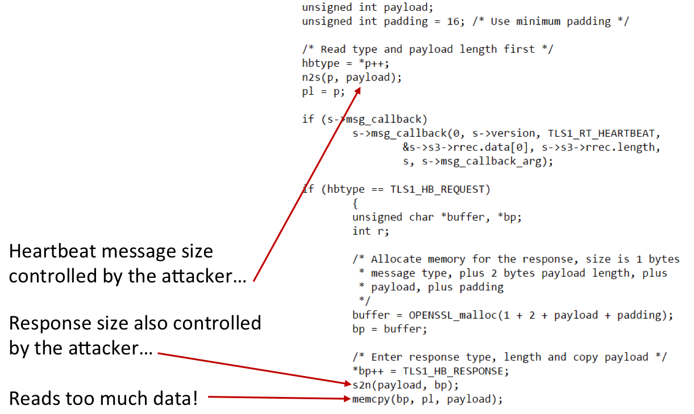
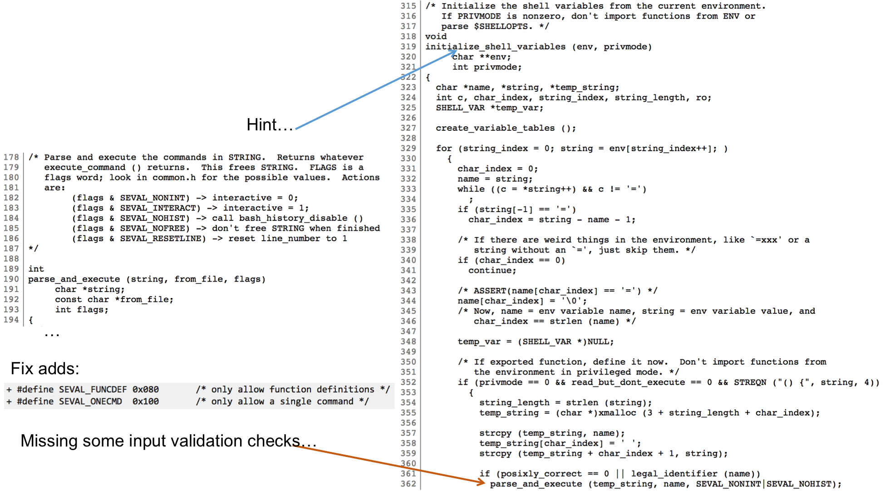
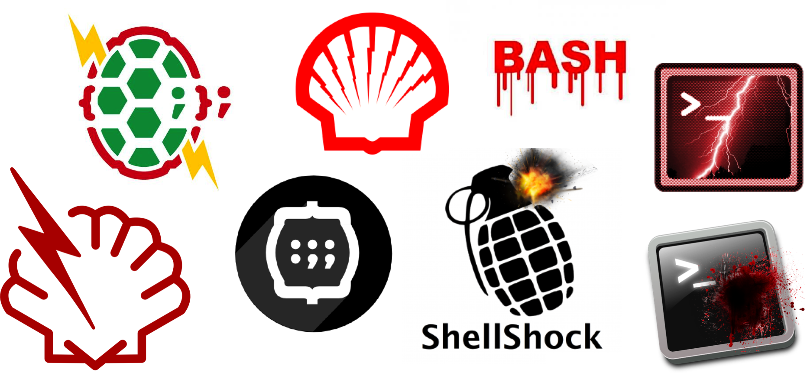

% Lecture 41 -  OS Security Concepts
% CprE 308
% April 20, 2015

# OS Security Concepts

## What have we learned about Operating Systems so far?
 - OS Goals
    - Resource Manager
    - User Interface
 - Important concepts we have discussed
    - Multi-user, multi-process, multi-thread
    - Synchronization, Mutual Exclusion, Deadlocks
    - Scheduling
    - Memory Management
    - I/O Devices
    - Files and File Systems
    
## What do we need in terms of security?

## What are the biggest problems?

Top 25 Most Dangerous Software Errors

[http://www.sans.org/top25-software-errors/](http://www.sans.org/top25-software-errors/)

Version 3.0, June 2011

## General Security Goals
 - Information Flow Secrecy
    - [Denning's Lattice Model](https://en.wikipedia.org/wiki/Lattice-based_access_control)
    - [Bell-LaPadula Model](https://en.wikipedia.org/wiki/Bell%E2%80%93LaPadula_model)
 - Information Flow Integrity
    - [Brewer and Nash (Chinese Wall) Model](https://en.wikipedia.org/wiki/Chinese_wall#Computer_science)
    - [Biba Integrity Model](https://en.wikipedia.org/wiki/Biba_Model)
    - [High/Low-water Mark Integrity](https://en.wikipedia.org/wiki/High-water_mark_%28computer_security%29)
    - [Clark-Wilson Integrity Model](https://en.wikipedia.org/wiki/Clark%E2%80%93Wilson_model)
 - [Covert Channels](https://en.wikipedia.org/wiki/Covert_channel)
    - The capability to transfer information between processes that are not supposed to be allowed to communicate by the computer security policy
 
## Is open source more secure than proprietary?

- "Security through Obscurity" is no security at all
     - [Kerckhoffs's principle](https://en.wikipedia.org/wiki/Kerckhoffs%27s_principle) (assume the enemy knows the system)
- Open Source "potentially" gets more eyes
     - Is that a false sense of security?
     - Are the right people looking?
     - Is the project well funded/staffed?

## Code snippet found in Linux Kernel

A bug or malware?

## Code snippet found in Linux Kernel

A bug or malware?

## Backdoor attempt found in Linux Kernel

Source: [https://freedom-to-tinker.com/blog/felten/the-linux-backdoor-attempt-of-2003](https://freedom-to-tinker.com/blog/felten/the-linux-backdoor-attempt-of-2003)

## Where's the problem?

## Apple SSL CVE-2014-1266 (GOTO Fail Bug)

## Apple SSL CVE-2014-1266 (GOTO Fail Bug)

- Should have been caught by automated tools
- Survived almost a year
- Affected OSX and iOS (because of shared code branches)

## Where's the problem?

## Heartbleed

## Heartbleed

- Much less obvious error
- Survived several professional code audits (for ~2 years)
- "Catastrophic" is the right word. On the scale of 1 to 10, this is an 11. ~Bruce Schneier

## Where's the problem?

## Shellshock

- Bug is the due to the absence of code (validation checks)
- Present for 25 years!?
- Even more complicated to find
- Still learning the extent of this bug

## Shellshock

## Passwords

Does your computer "store" your password?

Should it?

## Password Hashing

Goal: Don't store passwords!

Ideal Goal: Don't even "encrypt" passwords

- `hash(x) == hash(x)`
- `hash(x) != hash(y)`
- if `hash(x) == hash(x')` then `x` has not changed
- given `hash(x)`, `x` cannot be recovered
- it is infeasible to find a collision such that `hash(m1) == hash(m2)`

## Trusting Trust

- In 1984 Ken Thompson was presented with the ACM Turing Award
    - Famous acceptance speech "Reflections On Trusting Trust"
    - Highly encourage to read the speech
    - Link: [3 Page PDF](http://cs.unc.edu/~fabian/course_papers/trust.pdf)

## Resources

- [CprE 431/531 Information System Security](http://www.iac.iastate.edu/courses/#InfoSysSec)
- [CprE 532 Information Warefare](http://www.iac.iastate.edu/courses/#InfoWarfare)
- [CprE 533 Cryptography](http://www.iac.iastate.edu/courses/#Crypto)
- [CprE 536 Computer and Network Forensics](http://www.iac.iastate.edu/courses/#Forensics)
- [Security Technical Implementation Guides (STIGs)](http://iase.disa.mil/stigs/Pages/index.aspx)

Compete to win free security training invitation

[US Cyber Challenge](http://www.uscyberchallenge.org/) ([http://uscc.cyberquests.org](http://uscc.cyberquests.org/))
