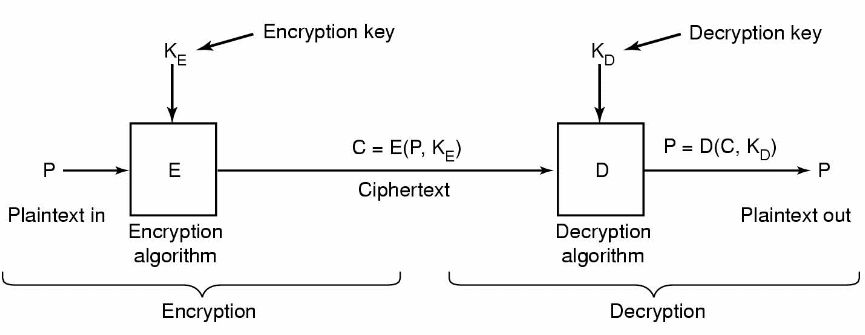

% Lecture 42 -  OS Security
% CprE 308
% April 23, 2014

# Intro

## Security Countermeasures

**What do we really need?**

 - From user perspective
 - From process/thread perspective
 - From file/directory/file system perspective
 - From memory management and other I/O device perspective
 - From service perspective
 - From network perspective
 - .....

## What we need in terms of security

 - Authentication
    - Username/password
    - One-time password
    - Smartcards/Activebadge
    - Biometrics
 - Access Control
    - User-based
    - Role-based
    - Location-based
    - Separation/Interaction, Multi-level Security
  - Data Confidentiality & Integrity
    - Encrypted file
    - Encrypted file system
  - Service/system availability/reliability
    - Redundancy: RAID, Multi-Core, etc.

## Access Control Fundamentals
 - Lampson's Access Matrix
 - Reference Monitor
 - A secure OS is the one that satisfies:
    - Complete Mediation: TOCTTOU (Time-of-check-to-time-of-use)
    - Tamperproof
    - Verifiable
 - Assessment Criteria

## Verifiable Security Goals
 - Information Flow
 - IF Secrecy
    - Denning's Lattice Model
    - Bell-LaPadula Model
 - IF Integrity
    - Biba Integrity Model
    - Low-water Mark Integrity
    - Clar-Wilson Integrity
 - Covert Channels

## History of Secure OSes
<!---
TPM - Trusted Platform Modules - cryptoprocessor with storage for keys

-->
 - Multics
 - UNIX/Windows Security
 - Security Kernels/TCB/SELinux
 - Microkernels/MicroVM
 - TPM

 - System Assurance
    - Orange BOok
    - Common Criteria

# Cryptography

## Crypto Building Blocks
 - Data Confidentiality & Integrity
    - Encrypted file
    - Encrypted file system
 - Hash Function

## Cryptography
 - Concerns the algorithms in security systems
    - Encryption, digital signatures, etc.
 - Cryptography insecure - system insecure
 - Cryptography secure - system might still be insecure!

## Encryption and Decryption

Relationship between the plaintext and the ciphertext

## Secret-key and Public-key
 - Secret keys
    - Encryption and decryption keys are private
    - Need a way to transfer these keys securely one time
 - Public Keys
    - Encryption key is common knowledge (public)
    - Decryption key is private

## (Symmetric) Secret Key Cryptography
 - Same (private) key used to encrypt and ecrypt
    - hence "symmetric"
 - Encryption and Decryption functions public
 - Requirement: Need a way to securely pass the key to the receiver

## Secret Key Example: Substitution Cipher

###
####
A - X

B - F

C - G

..

..

Z - Y

Substitution Ciphers can be (easily) broken

####
 - Plain Text: "Meet at four pm tomorrow"
 - Cipher Text: "Tddi xi hosa ..."
 - 26 char Encryption Key: "XFG...Y"
 - If the encryption key is known, decryption is easy.

## Secret Key Cryptography
 - Substitution Ciphers are not secure enough, but
 - Commonly used schemes:
    - Block Ciphers (work on blocks of data rather than individual characters)
    - Stream Ciphers (use the position of each character in the stream)
 - Requirement: Need a way to securely transmit the key to receiver

## (Asymmetric) Public Key Cryptography
 - Different keys for encryption and decryption, hence "Asymmetric"
    - Encryption key is public
    - Decryption key is private
 - If Alice wants to send a secure message to Bob:
    - Alice encrypts message using Bob's public key
    - Bob decrypts using his private key
    - An eavesdropper (Eve) can't make sense out of the message unless she knows Bob's private key
 - Diffie and Hellman, 1976

## Public Key Cryptography
 - Keys are generated as a pair (P,S) for each user
    - P = public, S = secret key
    - Usually inverses of each other
    - S(P(message)) = message
    - P(S(message)) = message
 - No need for sender and receiver to agree on keys beforehand
 - Public key dissemination through email, webpage, phonebooks(?)

## RSA Cryptosystem
 - \structure{R}ivest, \structure{S}hamir, and \structure{A}dleman in 1977
 - Rests upon the difficulty of factoring large numbers (which are the product of two primes)
 - If factoring is easy, then RSA can be broken
 - Converse is not proven!

# UNIX Passwords

## Case Studies
 - UNIX Password
 - Unix/Linux Access Control
    - Users and groups
    - File systems controls
 - (HW) Windows NT/XP Security Executive
    - Access Tokens
    - Security descriptors
    - ACLs
 - (HW) Windows Vista
    - Security additions

## Unix Reading Material
 - Man pages
    - groups, newgroup
    - chmod, chown, ghgrp
 - Unix and Security: The Influences of History
    - ftp://coast.cs.purdue.edu/pub/doc/misc/spaf-influences-of-history.ps.Z

## Basic Unix Security Model
 - User authenticated on logon
    - User ID associated with process
    - Default Group ID associated with process
    - Default Process listed in passwd file
 - Groups defined in `/etc/groups`
    - Set of users listed with each group definition
    - User can be member of multiple groups

## Passwords in UNIX
 - Login: `bpeck`
 - Password: `cpre308`

 - How does the system check if the password is correct?
 - One solution:
    - Password has (username, password) pairs
    - Store `[bpeck, cpre308]` in `/etc/passwd`
    - Password file readable only by privileged user
 - Privileged users can get your password
    - Why is this a problem?

## Solution: One-Way Functions
 - $f(x)$ is easy to compute
 - $f^{-1}(x)$ is extremely difficult, if not impossible, to compute
 - Unix password file contains image of each password
    - `/etc/password` contains `bpeck:y`
    - bpeck logs in, supplies `x`
    - if `f(x) == y`, then okay
 - Password file can now be world-readable

## Dictionary Attack (Morris and Thompson)
 - For all words in dictionary, compute $f(word)$
 - Find word such that $f(word) == y$
 - Many users use simple passwords
 - Systems that employ just one-way functions to protect their passwords are vulnerable to dictionary attacks

## Counterattack
**Salt**

 - for each password, create random "salt" value
 - `/etc/passwd` contains $f(append(word, salt)), salt)$
 - 12-bit salt values in Unix
 - attacker must do dictionary attack 4096 times, for each salt value
    - done ...
    - Feldmeier and Karn produced list of 732,000 most common passwords concatenated with each of 4096 salt values: covers ~30\% of all passwords

## Shadow Files
 - `/etc/passwd` and `/etc/group` must be readable by everyone
 - Both files contain crypt'ed passwords
    - Access enable offline attacks
 - Add shadow versions of each file
    - Password obscured in passwords and group
    - Stored in more restricted shadow version of these files

## Authentication
<!---
3-factors:

 1. Something the user knows
 2. Something the user has.
 3. Something the user is.
-->
 - Username/password
 - One-time password
 - Smartcards/Activebadge
 - Biomatrics

# Access Control

## Unix Access Control
<!---
Give basic theory here: draw domain/object matrix.  Access List by columns, capabilities list by rows.
-->
 - Three permission octets associated with each file and directory
    - Owner, group, and other
    - Read, write, execute
 - For each file/directory
    - Can specify RWX permission sfor one owner, one group, and one other

## Directory Permissions
 - To list the contents of a directory (do an `ls`), do we need:
    - read permission?
    - execute permission?
    - both?
 - To create/delete files?
 - To change directory to `/home/abc`, what permission do we need on `/home`?
 - To rename files `mv /home/abc/f1 /home/abc/f2`, what permissions do we need on:
    - `/home/abc`,
    - `/home/abc/f1`

## Unix Access Check
 - First test effective user ID against owner
    - If match, then use owner rights
 - Then test all groups user is a member of against group
    - If match, then use group rights
 - Otherwise, use other rights
 - Can view as rwx, or a value from 0-7
    - E.g. `rx = 5`, and `rw = 6`

## Constraining Control of New Objects
 - Umask can be set to constrain allowed access on new objects created by user
 - Expressed as a 3 octet mask
    - E.g. 0022
 - Inverse of umask anded by requested access for new object
    - E.g. open requests 0666 (read and write for all)
    - 0666 & ~0022 = 0666 & 755 = 644

## Other Bits
 - Set UID and Set GUID bits
    - When set, the process created by executing file takes on user ID or group ID associated with file
 - Sticky bit
    - On directories, prevents anyone but owner of file removing file in directory

## File System Extensions
 - Ext2 extra attributes
    - a: append only
    - c: compressed
    - s: secure deletion
    - u: undeletable
    - i: immutable

## Access Control
 - User-based
 - Role-based
 - Location-based
 - Separation/Interaction, Multi-level Security

## Unix Security Problems
 - Created as a subset of more complete Multics model
    - Expedient at this time
    - Limits modern expressibility
 - Security evolved over 30 years
    - Inconsistencies
 - Early evolution occurred in open university environments
    - Encourages bad habits

