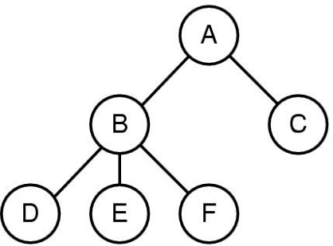
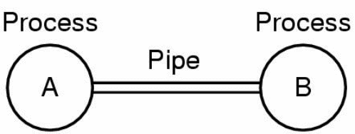
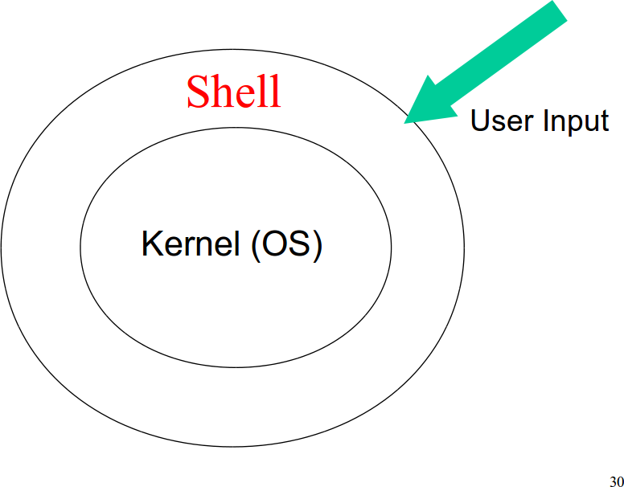
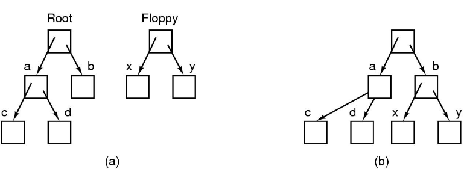

% Lecture 5
% CprE 308
% January 21, 2015

# Review from Last Week

## Processes

 - Process = program in execution
    - Address space: Program (text), data, stack
    - Registers: Program counter, stack pointer, etc.
 - Process can be created, suspended, restarted, killed (!)
 - Process scheduler decides which process to run next among all the current processes 

## Process Creation



 - In UNIX, there is a way for one process to ``spawn'' more processes
 - A process tree
    - Process A created two child processes, B and C
    - Process B created three child processes, D, E, and F

## Inter process communication (UNIX)


 - A  *pipe* is like a pseudo file
 - Processes set up a pipe in advance
 - Processes read from or write to a pipe

## Structure of UNIX


## System Calls

 - Interface between the user and the operating system (kernel)
 - Handle processes, files, directories, time, input/output
 - Switch processor from user to kernel mode
    - In *User mode*, some instructions are forbidden
    - In *Kernel mode*, all instructions are allowed

## Example
 - Read from file

    n = read(fd, buffer, nbytes);

 - Change directory

    s = chdir(dirname);

 - Get time

    s = time(&seconds);

## Mounting Files (UNIX)


 - Before mounting,
    - files on floppy are inaccessible
 - After mounting floppy on b,
    - files on floppy are part of file hierarchy

## Today's Topics
 - Memory Basics - Stack and Heap
 - Process Address Space

# Memory Basics

## Two Types of Memory
<!---
Draw on board as we introdude.  Stack at top, text/data at bottom, heap elsewhere.
-->
. . .

### Stack:
 - Automatically allocated and deallocated
 - Local variables, parameters
 - Used to implement function calls

. . .

### Heap:
 - Manually allocated and deallocated (sometimes not!)
 - Dynamic sized data structures
 - Used for data structures whose size is hard to predict


## Example C Program
<!---
Main function calls f.  Function f places a,b on stack.  Then the return value is placed in special register (or also on stack).
-->
```c
int main() {
    int a;
    a = f();
}
```

```c
int f() {
    int a,b;
    a = 10; b=10;
    return (a*b);
}
```


## Example C Program (2)
<!---
Another example, but with one more layer of stack calls.
-->
```c
int main() {
    int a;
    a = f();
}
```

```c
int f() {
    int a,
    a = 10;
    return (a*g());
}
```

```c
int g() {
    int a;
    a=100;
    return (a);
}
```

## Fibonacci Numbers
<!---
Fibonacci example.  Show stack trace with n=3.
-->
```c
int fib(int n) {
    if (n < 0) return 0;
    if (n ==0) return 1;
    if (n==1) return 1;
    return (fib(n-1)+fib(n-2));
}
```

## Using the Heap
<!---
Demonstrate how the heap works.
-->
```c
int main() {
    int i;
    int *c = (int*) malloc(10*sizeof(int));
    for(i=0;i<10;i++)
        c[i] = i*i;
    free(c);
}
```

## Linked Lists
<!---
Explain what Linked Lists are.  Here are some things we can do with them.
-->

>  - Computer Game
    - Maintain list of all moves made by the player
>  - Memory requirement unknown
    - Use dynamic memory, or the ``heap''

## Where would the following go?
<!---
Explain where each goes.
Parameters, Return values on stack.
Global variables in 'data'
User input probably on heap.
-->

> - Parameters, Return values
> - Global variables
> - User Input

## Garbage Collection
 - No need to explicitly deallocate memory 
    - i.e. no need for free() or equivalent
 - No memory leaks
 - Automatic Garbage Collection
 - A key feature of Java is its garbage-collected heap
