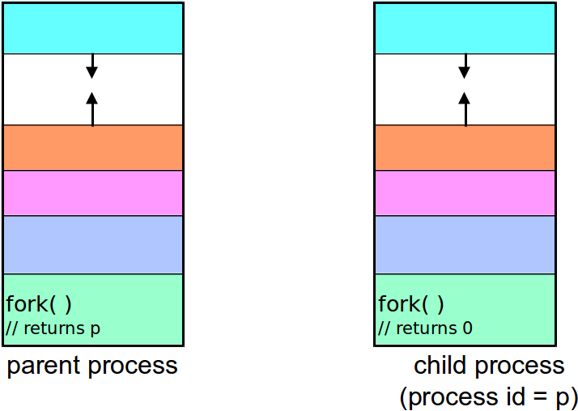
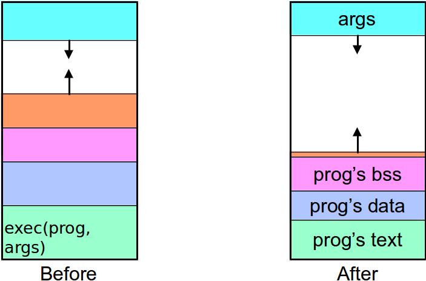
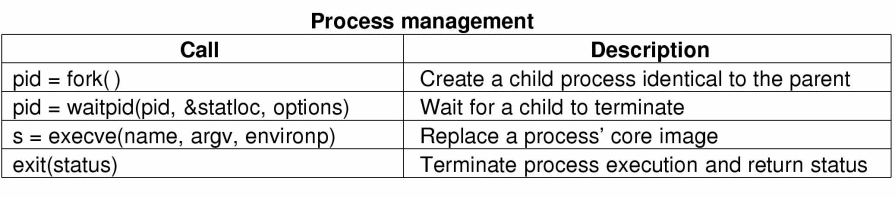

% Lecture 6
% CprE 308
% January 24, 2013

# Memory Basics Review
Include information here to clarify Stack/Heap/Data/BSS, etc.

## Today's Topics
 - Process Creation
 - File System Interface
 - System Calls for processes/files

# Process Creation

## Process
 - Address Space
 - Contents of registers
 - Other stuff - open files, etc.

## Address Space of a Unix Process


 - More about Different Segments: [http://www.informit.com/articles/article.asp?p=173438](http://www.informit.com/articles/article.asp?p=173438)

## The fork() system call
```c
#include <unistd.h>
pid_t fork(void); // prototype for fork
```
 - `fork()` returns a process id (a small integer)
 - `fork()` returns twice!
    - In the parent - `fork` returns the id of the child process
    - In the child - `fork` returns a 0

## Example
```c
#include <unistd.h>
#include <stdio.h>
void main(void) {
  pid_t pid = fork();
  if(pid > 0)
    printf("I am the parent\n");
  else if (pid == 0)
    printf("I am the child\n");
  printf("ERROR!\n");
}
```

## Creating a Process: Before fork()


## Creating a Process: After fork()


## Parent and Child Processes
 - The child process is a *copy* of the parent process
    - It is running the same program
    - Same memory contents
    - It has its own process ID
 - The child process inherits many attributes from the parent, including:
    - current working directory, user id
    - group id

## Process Hierarchies
 - UNIX: Parent creates a child process, child can create more processes
    - Forms a hierarchy
    - UNIX calls this a ``process group''
    - All processes within a group are logically related

 - Windows has no concept of process hierarchy
    - all process are created equal

## Death and Destruction
 - All processes usually end at some time during runtime (with the exception of init)
 - Processes may end either by:
    - executing a `return` from the main function
    - calling the `exit(int)` function
    - calling the `abort(int)` function
 - When a process exits, the OS delivers a termination status to the parent process

## Waiting
 - Parent processes often wait for their child process to end
 - Parent processes do that via a `wait()` call
    - `pid_t wait(int * status);`
    - `pid_t waitpid( pid_t pid int* status,...);`

## Switching Programs
 - `fork()` creates a new process
 - This would be almost useless if there was not a way to switch which *program* is associated with the new process
 - The `exec()` system call is used to load a new program into an existing process

## `exec()`: Loading a New Image


## `exec()` example
```c
#include <unistd.h>
main() {
  printf("executing ln\n");
  execl("/bin/ls", "ls", "-l", (char*)0);
  /* if execl returns, the call failed */
  perror("execl failed to run ls");
  exit(1);
}
```

## System Calls for Process Management


## More `fork()`
 - How many processes does this piece of code create?

```c
int main() {
  fork();
  fork();
}
```

## Bad Example (don't try this!)
```c
#include <unistd.h>
#include <stdio.h>
void main(void) {
  while (!fork())
    printf("I am the child %d\n", getpid());
  printf("I am the parent %d\n", getpid());
}
```

. . .

### Fork Bomb!

## Fork/Exec Example
```c
if (fork( ) == 0) {
  // child process
  // set up I/O in child
  execv(newprogram, parameters);
  // load new image
  // if we get here, there’s a problem
}
// parent process continues here
```

## A stripped down shell
```c
while (TRUE) {	/* repeat forever */
    /* display prompt, get input */
    type_prompt( );
    read_command (command, parameters)
 
    /* fork off child process */ 
    if (fork() != 0) {
         /* Parent code - wait for child to exit */
         waitpid( -1, &status, 0); 
    } else {
         /* Child code - execute command */
         execve (command, parameters, 0);
 }
```

## What is the output of this?
```c
int main() {
   int i;
   for (i=0; i<3; i++) {
     fork();
     printf(“%d\n”,i);
   }
   return (0);
}
```
