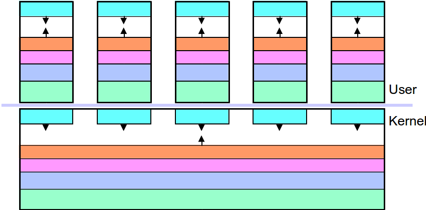
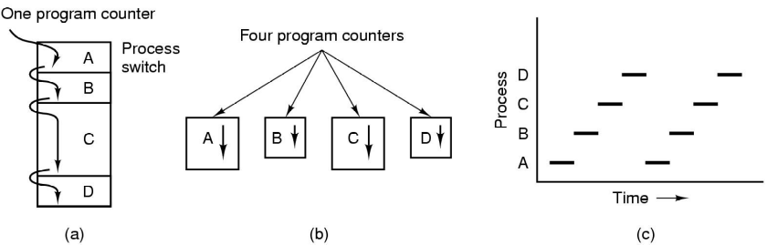

% Lecture 8
% CprE 308
% January 29, 2013

# Intro

## Today's Topics
 - Processes and Multiprogramming
 - How is multiprogramming implemented?
    - Process context switch

# Multiprogramming

## Processes and Multiprogramming
 - Multiprogramming
    - Many processes executing in parallel
 - Imagine not having it (DOS)
    - Type in command
    - Wait for result
    - Can't browse in the meanwhile!

## Multi Processes = Multiple Address Spaces

## Well..we still have only one processor
 - Will the following get sped up with multiprogramming
    - Four compilations running in parallel
    - A compliation and a text editor
    - Four parallel internet downloads

## The Process Model

 - Conceptual model of 4 independent, sequential processes
 - Only one program active at any instant
 - Switch from one process to another by "context switch"

## Process Creation and Termination
When do new processes get created?

 - Any command -- Ex: Click on the IE icon
 - First process?

When do processes get terminated?

 1. Normal exit (voluntary) - `exit()` system call
 2. Error exit (voluntary) - `exit()` system call
 3. Fatal error (involuntary)
 4. Killed by another process (involuntary)

# Implementation

## Implementation of Multiprogramming
 - Context Switch
    - Requires (CPU) taken away from one process and given to another
 - Save the context of previous process and restore context of new process

## Process Context?
 - Contents of Reigsters
 - Program Counter
 - Stack Pointer
 - Process State
 - Open file descriptors
 - ...
 - Operating System stores process contexts in *Process Table* - one entry per process

## When to Switch Context
 - When a process waits for I/O
 - When a process has got its quota of time
 - When a previously started I/O has completed

## Process States

 - Possible process states:
    - Running
    - Blocked
    - Ready

## Process States (cont)

## How to Switch Context?

How would you force a process to give up the processor to another process?

## Interrupt Driven Context Switch
 - Interrupt occurs (timer or I/O0
 - Each interrupt has its own service procedure (address given by interrupt vector)
 - Save some context and then jump to interrupt service procedure
 - **Scheduler** might context switch after the interrupt is serviced

## Process Implementation
### Skeleton of what lowest level of OS does when an interrupt occurs
 1. Hardware stacks program counter, etc.
 2. Hardware loads new program counter from interrupt vector.
 3. Assembly language procedure saves registers.
 4. Assembly language procedure sets up new stack.
 5. C interrupt service runs (typically reads and buffers input).
 6. Scheduler decides which process is to run next.
 7. C prodecure returns to the assembly code.
 8. Assembly language procedure starts up new current process.

## Some Questions
 - Why can't we voluntarily change to privleged (kernel) mode?
 - Why do we need a separate kernel stack for each process?
 - Is the scheduler a separate process?
