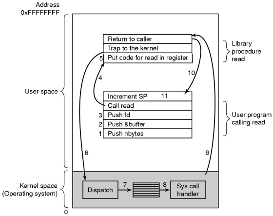
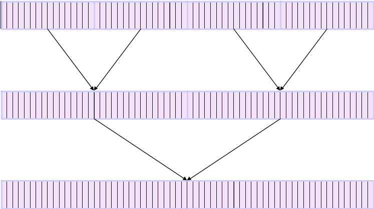
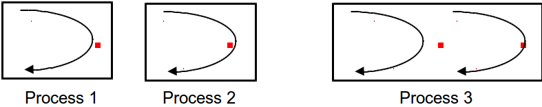
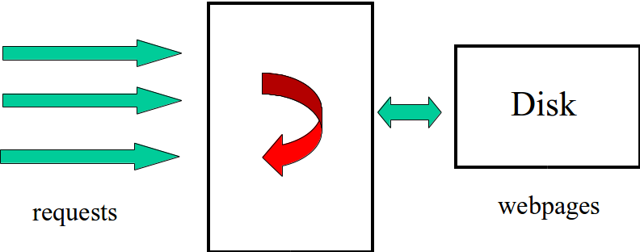

% Lecture 9
% CprE 308
% January 31, 2013

# Intro

## Today's Topics
 - Threads
    - Why?
    - How?

# Threads

## Steps in Making a System Call


 - There are 11 steps in making the system call

    `read(fd,buffer,nbytes)`

## The need for Threads
 - Think Performance
    - High performance web server
    - Web Browser
 - Not able to (easily) overlap I/O and computation in a single process

## Background Processing: Emacs
Bad emacs clipart??

## Parallel Merge Sort


## Threads
 - Multiple "threads" of control within a single process
 - Threads share process address space
 - Why not use multiple processes?
    - Process creation expensive
    - Each process needs memory, lots of state
    - We don't need all that...

## Process vs. Threads


## Single Threaded Web Server


## Multi Threaded Web Server


## Pseudocode with Threads

### Dispatcher
```c
while(1) {
  get_request(&req);
  start_new_worker(req);
}
```
### Worker
```c
Worker_thread(req) {
  fetch_webpage(req,&page);
  return_page(req,page);
}
```

## Threads
 - Multiple threads in the same address space
    - Each thread has its own stack, registers, program counter
 - All threads within a process share the same text (code) and data segment

## Process vs Threads
 - Creating a new thread 100 times chaper than creating a new process
 - Switching between two threads also chaper
 - Thread = "Lightweight process"

## The Thread Model
### Per process Items
 - Address Space
 - Global variables
 - Open files
 - Child processes
 - Pending alarms
 - Signals and signal handlers
 - Accounting information

### Per thread items
 - Program counter
 - Reigsters
 - Stack
 - State


