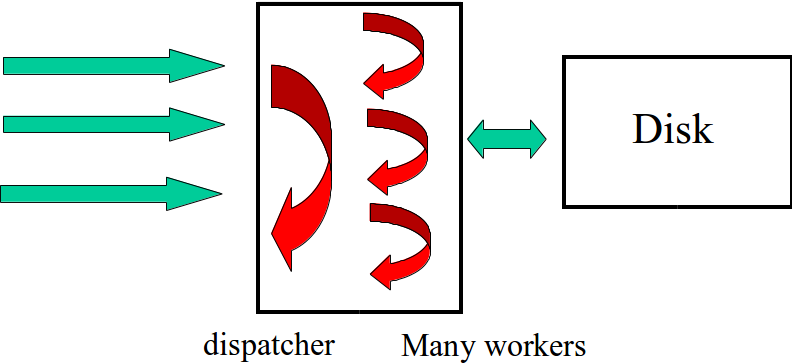

% Lecture 9
% CprE 308
% January 30, 2015

# Intro

## Today's Topics
 - Threads
    - Why?
    - How?

# Threads

## The need for Threads
 - Think Performance
    - High performance web server
    - Web Browser
 - Not able to (easily) overlap I/O and computation in a single process

## Parallel Merge Sort


## Threads
 - Multiple "threads" of control within a single process
 - Threads share process address space

## Why not multiple processes?
> - Process creation expensive
> - Each process needs memory, lots of state
> - We don't need all that...

## Process vs. Threads


## Single Threaded Web Server


## Multi Threaded Web Server


## Pseudocode with Threads

### Dispatcher
```c
while(1) {
  get_request(&req);
  start_new_worker(req);
}
```
### Worker
```c
Worker_thread(req) {
  fetch_webpage(req,&page);
  return_page(req,page);
}
```

## Threads
> - Multiple threads in the same address space
>    - Each thread has its own stack, registers, program counter
>  - All threads within a process share the same text (code) and data segment

## Process vs Threads
 - Creating a new thread 100 times cheaper than creating a new process
 - Switching between two threads also chaper
 - Thread = "Lightweight process"

## The Thread Model

| Per process Items | Per thread items |
|-------------------|------------------|
| Address space | Program counter |
| Global variables | Registers |
| Open files | Stack |
| Child processes | State |
| Pending alarms | |
| Signals and signal handlers | |
| Accounting information | |

